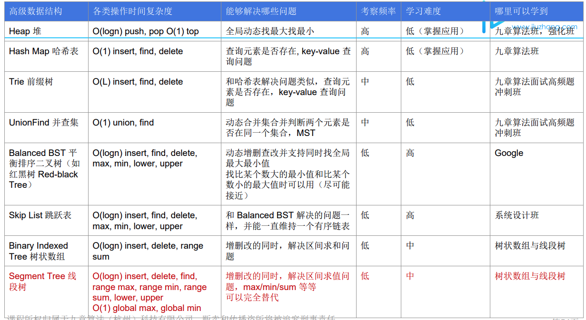
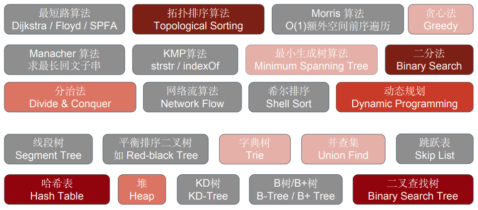
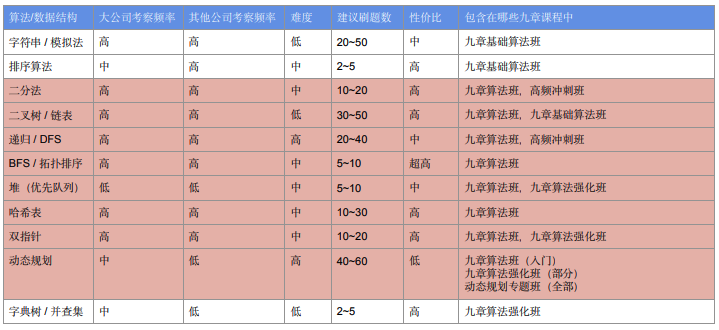

# Lint/LeeCode notes

## Guideline 

Notes mainly comprises two parts:

### LintCode:

* Topic / category summary from "Jiuzhang Algorithm" course
* Related ladders practice and solution 

### LeetCode:

* Cover problems not in LintCode
* Weekly Challenges

## Common Algorithm in Interview

* O\(logn\):Binary Search
* O\(sqrt\(n\)\): Factorization
* O\(n\): Two Pointer, Monotone Stack, Enumeration
* O\(nlogn\): Sorting, O\(n \* logn \* process on data structure0
* O\(n^2\), O\(n^3\), Dynamic Programming
* O\(2^n\): Combination search
* O\(n!\): Permutation Search 

## Common Data Structure in Interview

## Time Complexity

### Polynomial: 

* O\(n\)m, O\(n^2\), O\(n^3\), O\(n + m\), O\(sqrt\(n\)\), O\(1\), O\(logn\), O\(nlogn\)

### Nondeterministic Polynomial \(NP\)

* O\(2^n\), O\(n^n\), O\(n!\)
* Question: 
  * O\(n + m\) vs O\(max\(n, m\)\)?
    * n + m  &gt; max\(n, m\) &gt; \(n + m\) / 2 O\(n + m\) &gt; O\(max\(n, m\)\) &gt; O\(\(n + m\) / 2\) O\(max\(n, m\)\) == O\(n + m\)

## Unfinished Chapter

### Algo\_2021

* Chap 17 \(TSP\)

