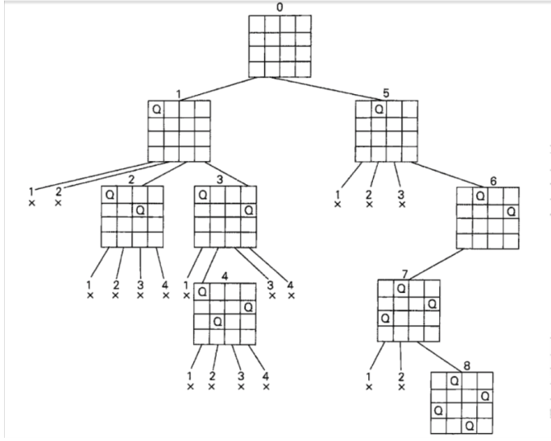

# 33. N-Queens \(M\)

## Problem

### Description

### Example

## Approach

### Intuition



### Algorithm

#### Step by Step

### Code



```python

```



```

```



### Complexity Analysis

* **Time Complexity:**
* **Space Complexity:**

