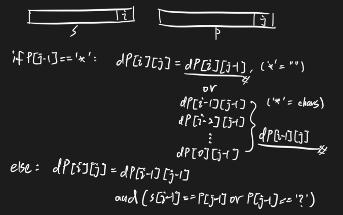

# 192. Wildcard Matching \(H\)

## Problem

[https://www.lintcode.com/problem/192/](https://www.lintcode.com/problem/192/)

### Description

Implement wildcard pattern matching with support for `'?'` and `'*'`.

* `'?'` Matches any single character.
* `'*'` Matches any sequence of characters \(including the empty sequence\).

The matching should cover the entire input string \(not partial\).


1&lt;=\|s\|, \|p\| &lt;= 1000  
It is guaranteed that `𝑠` only contains lowercase Latin letters and `p` contains lowercase Latin letters , `?` and `*`


### Example

**Example 1**

```text
Input:
"aa"
"a"
Output: false
```

**Example 2**

```text
Input:
"aa"
"aa"
Output: true
```

**Example 3**

```text
Input:
"aaa"
"aa"
Output: false
```

**Example 4**

```text
Input:
"aa"
"*"
Output: true
Explanation: '*' can replace any string
```

**Example 5**

```text
Input:
"aa"
"a*"
Output: true
```

**Example 6**

```text
Input:
"ab"
"?*"
Output: true
Explanation: '?' -> 'a' '*' -> 'b'
```

**Example 7**

```text
Input:
"aab"
"c*a*b"
Output: false
```

## Approach - DP

### Intuition



### Algorithm

#### Step by Step

### Code



```python
class Solution:
    """
    @param s: A string 
    @param p: A string includes "?" and "*"
    @return: is Match?
    """
    def isMatch(self, s, p):
        # write your code here
        if not s and not p:
            return False
        
        n, m = len(s), len(p)
        # state
        dp = [[False] * (m + 1) for _ in range(n + 1)]

        # initialization 
        dp[0][0] = True
        for i in range(1, m + 1):
            dp[0][i] = dp[0][i - 1] and p[i - 1] == '*'
        
        # function
        for i in range(1, n + 1):
            for j in range(1, m + 1):
                if p[j - 1] == '*':
                    dp[i][j] = dp[i - 1][j] or dp[i][j - 1]
                else:
                    dp[i][j] = dp[i - 1][j - 1] and (s[i - 1] == p[j - 1] or p[j - 1] == '?')
        return dp[n][m]

```



```

```



### Complexity Analysis

* **Time Complexity:**
* **Space Complexity:**

