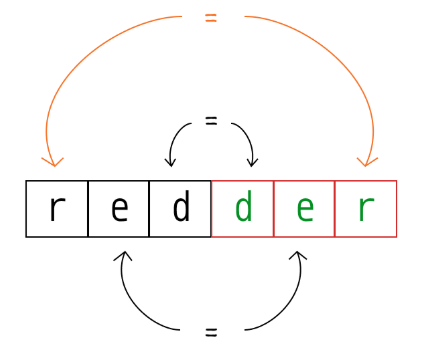

# 415. Valid Palindrome \(M\)

## Problem

[https://www.lintcode.com/problem/415](https://www.lintcode.com/problem/415)

### Description 

Given a string, determine if it is a palindrome, considering only alphanumeric characters and ignoring cases.


Have you consider that the string might be empty? This is a good question to ask during an interview. For the purpose of this problem, we define empty string as valid palindrome.


### Example

**Example 1:**

```text
Input: "A man, a plan, a canal: Panama"
Output: true
Explanation: "amanaplanacanalpanama"
```

### **Example 2:**

```text
Input: "race a car"
Output: false
Explanation: "raceacar"
```

## Approach: Two Pointers

### Intuition:

Simply speaking, if one word were to start in the middle of a palindrome, and traverse outwards then would encounter the same characters, in same order, in both halves



### Algorithm: 

Making two pointers, one points the left\(start\), the other points to the right\(end\), and make them go inwards toward the middle! Ignore the non-alphanumeric characters, and check if two pointers point to same character \(should unify casting\) respectively. 

#### Step by step: 

* Set two pointers, one at each end of input string
* Can simply ignore non-alphanumeric characters by continuing traverse further 
* If input is palindromic, both pointers should point to equivalent character, at all times
  * If condition not met, can break earlier
* Continue traversing until pointers meet in middle 

## Code



```python
class Solution:
    """
    @param s: A string
    @return: Whether the string is a valid palindrome
    """
    def isPalindrome(self, s):
        # write your code here
        
        # two pointers
        left, right = 0, len(s) - 1
        
        while left < right:
            # if non-alphanumeric characters, keep traversing
            while left < right and not s[left].isalnum():
                left+=1
            while left < right and not s[right].isalnum():
                right-=1
            # if not the same, break earlier
            if s[left].lower() != s[right].lower():
                return False
            # keep traversing
            left+=1
            right-=1
        return True
```



```java
public class Solution {
    /**
     * @param s: A string
     * @return: Whether the string is a valid palindrome
     */
    public boolean isPalindrome(String s) {
        // write your code here
        
        // two pointers
        int left = 0, right = s.length() - 1;
        while (left < right) {
            
            // if non-alphanumeric characters, keep traversing
            while (left < right && !Character.isLetterOrDigit(s.charAt(left))) {
                left++;
            }
            while(left < right && !Character.isLetterOrDigit(s.charAt(right))) {
                right--;
            }
            // if not the same, break earlier
            if (Character.toLowerCase(s.charAt(left)) != Character.toLowerCase(s.charAt(right))) {
                return false;
            }
             // keep traversing
            left++;
            right--;
            }
         return true;
    }
}
```



### Technic

| Python string class | Java Character class |
| :--- | :--- |
| `string.isdigit()` | `public static boolean isDigit(int codePoint)` |
| `string.isalpha()` | `public static boolean isAlphabetic(int codePoint)` |
| `string.isalnum()` | `public static boolean isLetterorDigit(int codePoint)` |
| `string.lower()` | `public static boolean isLowerCase(char ch)` |
| `string.upper()` | `public static boolean isUpperCase(char ch)` |
| `string.islower()` | `public static boolean isLowerCase(char ch)` |

## Complexity Analysis

* **Time Complexity:** **O\(n\)**
  * In length n of the string, travers over each character at-most once, until two pointer meet in the middle, or break and return early
* **Space Complexity: O\(1\)**
  * No extra space required 


