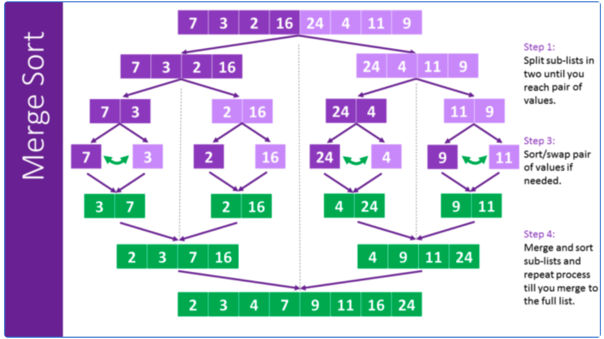

# 464. Sort Integers II \(E\)

## Problem

[https://www.lintcode.com/problem/464/](https://www.lintcode.com/problem/merge-two-sorted-arrays)

### Description 

Merge two given sorted ascending integer array _A_ and _B_ into a new sorted integer array.

### Example

**Example 1:**

```text
Input:  A=[1], B=[1]
Output: [1,1]	
Explanation:  return array merged.
```

**Example 2:**

```text
Input:  A=[1,2,3,4], B=[2,4,5,6]
Output: [1,2,2,3,4,4,5,6]	
Explanation: return array merged.
```

## Approach: Quick Sort

### Intuition:

Two pointers on A/B array, and compares their values with each other 

### Algorithm: 

Two pointers traverse A/B array, and pick the minimum one into result. The result array length equals to length of A plus length of B. 

#### Step by step: 

* Two pointers on start of A/B array
* Traverse in total length of A/B: 
  * If pointer in valid range then compare values and put the smaller one into result
  * pointer ++ after each round

### Code



```python
class Solution:
    """
    @param A: an integer array
    @return: nothing
    """
    def sortIntegers2(self, A):
        # write your code here
        if not A: 
            return 
        self.quick_sort_helper(A, 0, len(A) - 1)
    def quick_sort_helper(self, A, start, end):
        if start >= end:
            return 
        
        left, right = start, end
        # select pivot 
        pivot = A[start + (end - start)//2]
        
        while left <= right:
            # shift left if value < pivot
            while left <= right and A[left] < pivot:
                left+=1
            
            # shift right if value > pivot
            while right >= left and A[right] > pivot:
                right-=1
            
            # exchange value
            if left <= right:
                A[left], A[right] = A[right], A[left]
                left+=1
                right-=1
        
        # keep doing partition        
        self.quick_sort_helper(A, start, right)
        self.quick_sort_helper(A, left, end)
```



```java
public class Solution {
    /**
     * @param A: an integer array
     * @return: nothing
     */
    public void sortIntegers2(int[] A) {
        // write your code here
        if (A == null || A.length == 0) {
            return;
        }
        // start quick sort 
        quickSort(A, 0, A.length - 1);
    }

    private void quickSort(int[] A, int start, int end) {
        if (start >= end) {
            return;
        }
     
        int left = start, right = end;

        // 1. select pivot, between A[start], A[end], get value not index 
        int pivot = A[start + (end - start)/2];

        // 2. left <= right not left < right
        while (left <= right) {
            // traverse left and right for values that need to be swap
            while(left <= right && A[left] < pivot) {
                left++;
            }
            while(left <= right && A[right] > pivot) {
                right--;
            }
            // swap value 
            if (left <= right) {
                int tmp = A[left];
                A[left] = A[right];
                A[right] = tmp;
                left++;
                right--;
            }
        }
        // keep sorting the rmained left/right parts
        quickSort(A, start, right);
        quickSort(A, left, end);
    }
}
```



### Complexity Analysis

* **Time Complexity:** **O\(n^2\)/O\(nlog\(n\)\)**
  * The pivot we choose impact the time complexity
    * Worst: **O\(n^2\)**
      * If pivot = index0, since every partition level: n, n-1, n-2...1
    * Best: **O\(nlog\(n\)\)**
      * If pivot = middle index
* **Space Complexity: O\(n\)/O\(logn\)**
  * Since during partition no extra space needed \(**O\(1\)**\)
  * Only need to analyze call stack frame:
    * Worst: **O\(n\)**
      * If pivot = index0, require n -1 times stack calling
    * Best: **O\(logn\)**
      * If pivot = middle index

## Approach: Merge Sort

### Intuition: 

Split a unsorted array recursively until single element, then merge all of the in order. \(Divide and Conquer\)



### Algorithm: 

Split an array from the middle until single element remained. Later merge all the arrays together in order, eventually can obtain a sorted array.

#### Step by Step:

* Keep splitting array from the middle, return when when left &lt;= right \(means single element\)
* Merge those two parts \(now two parts of arrays are sorted\)
  * Use temp array to store sorted part
* Assign sorted parts back to original array

### Code:



```python
class Solution:
    """
    @param A: an integer array
    @return: nothing
    """
    def sortIntegers2(self, A):
        # write your code here
        if not A: 
            return
        
        tmp = [0 for _ in range(len(A))]
        self.merge_sort(A, 0, len(A) - 1, tmp)
    
    def merge_sort(self, A, start, end, tmp):
        # when split into single element, return 
        if start >= end:
            return 
        mid = start + (end - start)//2
        # keep split in half
        self.merge_sort(A, start, mid, tmp)
        self.merge_sort(A, mid + 1, end, tmp)
        # merge the two half array into tmp
        self.merge(A, start, end, tmp)
    
    def merge(self, A, start, end, tmp):
        left = start
        mid = start + (end - start)//2
        right = mid + 1
        n = end - start + 1
        
        for k in range(n):
            # merge two sorted arrays
            if left <= mid and (right > end or A[left] <= A[right]):
                tmp[k] = A[left]
                left+=1
            else:
                tmp[k] = A[right]
                right+=1
        # assign back to original array A
        for k in range(n):
            A[start + k] = tmp[k]
        

        
   
```



```java
public class Solution {
    /**
     * @param A: an integer array
     * @return: nothing
     */
    public void sortIntegers2(int[] A) {
        // write your code here
        int[] tmp = new int[A.length];
        mergeSort(A, 0, A.length - 1, tmp);
    }
    private void mergeSort(int[] A, int start, int end, int[] tmp) {
        // when split into single element, return
        if (start >= end) {
            return;
        }
        int mid = start + (end - start)/2; 
        // keep split in half
        mergeSort(A, start, mid, tmp);
        mergeSort(A, mid + 1, end, tmp);
        // merge two half array into tmp
        merge(A, start, end, tmp);
    }
    
    private void merge(int[] A, int start, int end, int[] tmp) {
        int n = end - start + 1;
        int mid = (start + end) / 2;
        int left = start, right = mid + 1;
        
        for (int k = 0; k < n; k++) {
            // merge two sorted arrays
            if ((left <= mid) && (right > end || A[left] <= A[right])) {
                tmp[k] = A[left];
                left++;
            } else {
                tmp[k] = A[right];
                right++;
            }
        }
        
        // assign back to original array A
        for (int k = 0; k < n; k++) {
            A[start + k] = tmp[k];
        }
    }
}
```



### Complexity Analysis:

* **Time Complexity: O\(nlog\(n\)\)**
  * Split: O\(logn\)
  * Merge: O\(n\)
* **Space Complexity: O\(n\)**
  * Heap: O\(n\)
    * Require temp array for storing merging part
  * Stack: O\(logn\)
    * Call stack equals to splitting times

