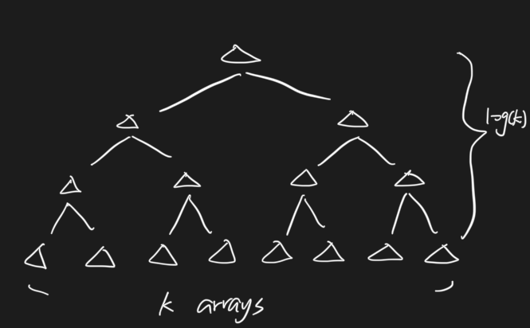

# 486. Merge K Sorted Arrays \(M\)

## Problem

[https://www.lintcode.com/problem/104/](https://www.lintcode.com/problem/merge-k-sorted-arrays/)

### Description

Given _k_ sorted integer arrays, merge them into one sorted array.

### Example

**Example 1:**

```text
Input: 
  [
    [1, 3, 5, 7],
    [2, 4, 6],
    [0, 8, 9, 10, 11]
  ]
Output: [0, 1, 2, 3, 4, 5, 6, 7, 8, 9, 10, 11]
```

**Example 2:**

```text
Input:
  [
    [1,2,3],
    [1,2]
  ]
Output: [1,1,2,2,3]
```

## Approach - Iteratively Merge Two

### Intuition

Iteratively merge two array, eventually would reach one list then return 



### Algorithm

Merge every two arrays \(so total arrays amount would go half\), and iteratively does this to reach one final list

#### Step by Step

* While arrays amount &gt; 1:
  * Iteratively merge two sorted arrays
    * If lists amount is odd, need to take care outside the for loop \(interval as 2\)
  * Update the original arrays
  * Eventually array would remains one
    * Return first array

### Code



```python
class Solution:
    """
    @param arrays: k sorted integer arrays
    @return: a sorted array
    """
    def mergekSortedArrays(self, arrays):
        # write your code here
        while len(arrays) > 1:
            new_arrays, merge_array = [], []
            for i in range(1, len(arrays), 2):
                merge_array = self.merge_arrays(arrays[i - 1], arrays[i])
                new_arrays.append(merge_array)
            if len(arrays)%2 == 1:
                new_arrays.append(arrays[len(arrays) - 1])
            arrays = new_arrays
        # WARNING!
        # the first one is the sorted array
        return arrays[0]

    # merge two sorted arrays
    def merge_arrays(self, a1, a2):
        new_arr = []
        if not a1:
            return a2
        if not a2:
            return a1
        
        l1, l2 = len(a1), len(a2)
        i, j = 0, 0
        for k in range(l1 + l2):
            if i < l1 and (j >= l2 or a1[i] < a2[j]):
                new_arr.append(a1[i])
                i+=1
            else:
                new_arr.append(a2[j])
                j+=1
        return new_arr
```



```

```



### Complexity Analysis

* **Time Complexity: O\(nlogk\)**
  * n as total node in lists
  * k as the amount of lists
* **Space Complexity: O\(n\)**
  * Need to create temp list to store the merge list

## Approach - Divide and Conquer Merging

### Intuition


Recursively doing split and merge \(exactly same as merge sort principle\)

### Algorithm

Split the lists from middle into halves, then recursively do this until reach every single list, then do the merge two by two 

#### Step by Step

* Divide and Conquer \(recursion\)
  * Split lists into half from middle \(start, middle / middle + 1, end\)
    * Break if start &gt;= end
    * Merge two lists

### Code



```python
"""
Definition of ListNode
class ListNode(object):

    def __init__(self, val, next=None):
        self.val = val
        self.next = next
"""
class Solution:
    """
    @param lists: a list of ListNode
    @return: The head of one sorted list.
    """
    def mergeKLists(self, lists):
        # write your code here
        if not list:
            return None
        
        # since eventually would be 1 list left
        return self.merge_helper(lists, 0, len(lists) - 1)
    
    def merge_helper(self, lists, start, end):
        if start >= end:
            return lists[start]
        mid = (start + end)//2
        left = self.merge_helper(lists, start, mid)
        right = self.merge_helper(lists, mid + 1, end)
        return self.merge(left, right)

    # merge two sorted list 
    def merge(self, n1, n2):
        dummy = ListNode(None)
        cur = dummy
        if not n1 and not n2:
            return dummy.next
        while n1 != None and n2 != None:
            if n1.val < n2.val:
                cur.next = n1
                n1 = n1.next
            else:
                cur.next = n2
                n2 = n2.next
            cur = cur.next
        if not n1:
            cur.next = n2
        if not n2:
            cur.next = n1
        return dummy.next
```



```

```



### Complexity Analysis

* **Time Complexity: O\(nlogk\)**
  * n as total node in lists
  * k as the amount of lists
* **Space Complexity: O\(1\)**
  * Constant space complexity

