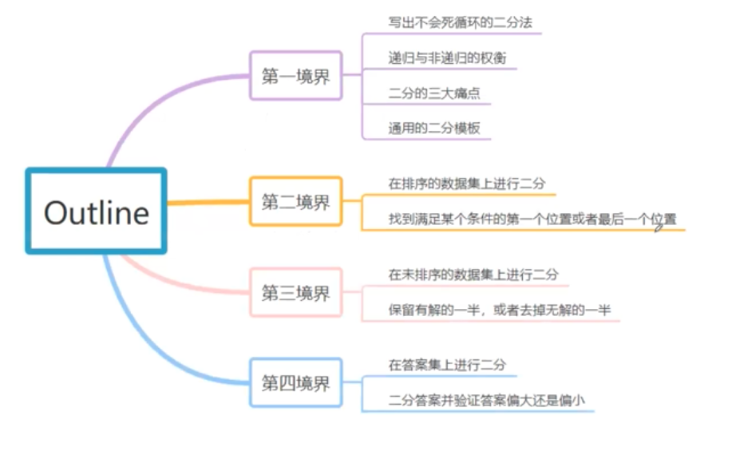

# Binary Search

## Binary Selection 

Arguably one of the most frequent interview question

### Application

To find certain number in a sorted array, its time complexity is O\(logn\), better than regular O\(n\)


### Recursion or Non-Recursion?



### Template



```python
class Solution:
    # @param nums: The integer array
    # @param target: Target number to find
    # @return the first position of target in nums, position start from 0 
    def binarySearch(self, nums, target):
        if not nums:
            return -1

        start, end = 0, len(nums) - 1
        # Use "start + 1" < end and not "start < end" to avoid deadlock 
        # In first position of target no dead lock
        # But in last position of target would have dead lock
        # Ex：nums=[1，1] target = 1
        # To unify template: start + 1 < end，guarantee no deadlock 
        while start + 1 < end:
            # python no overflow problem, can write like this
            # java/C++ better write as mid = start + (end - start) / 2
            # to avoid when start = 2^31 - 1, end = 2^31 - 1, overflow happened
            mid = (start + end) // 2
         
            # can write as start = mid + 1
            # however, in some case finding target interval, this may lost some value
            # writing as start = mid won't affect algorithm correctness
            # still O(logn) (like logn vs log(n+1), both is Ologn)
            if nums[mid] < target:
                start = mid
            # WARNING!
            # In first position, should be "end = mid", since we care if there any target before mid
            # In last position, should be "start = mid", since we care if there any target after mid
            # template here show for first position case
            elif nums[mid] == target:
                end = mid
            else: # nums[mid] > target
                end = mid

        # search again in start/end
        # since above while loop end when reaching two element left (start + end)
        # these two still need check up 
        if nums[start] == target:
            return start
        if nums[end] == target:
            return end

        return -1
```



## T function calculating Time Complexity

### T 函数推导法

我们介绍一种时间复杂度的推导方法：T函数推导法  
比如二分法。二分法是每次通过 O\(1\) 的时间将规模为 n 的问题降低为规模为 n/2的问题。  
这里我们用 T\(n\) 来表示规模为 n 的问题在该算法下的时间复杂度，那么我们得出推导公式：

T\(n\) = T\(n/2\) + O\(1\)

我们来逐个说明一下这个公式的意义。

首先 T 代表的是 Time Complexity,n 代表的是问题规模（二分法里就是数组的大小）。  
那么 **T\(n\)** 代表的就是：**求处理问题规模为n的数据的时间复杂度是多少**。注意这里是一个问句，不是一个答案。  
T\(n\) 根据算法的不同可以是O\(n\), 也可以是 O\(nlogn\)或任何值，而 O\(n\) 就是 O\(n\)。

然后 O 代表的是时间复杂度。O\(1\) 就意味着，你大概用一个 if 语句，或者简单的加加减减，就可以完成。O 在这里的意思是数量级约等于。在 O 的世界里，我们只考虑最高项是什么，不考虑系数和常数项。比如：

* O\(100n\) = O\(n\)
* O\(n^2 + n\) = O\(n^2\)
* O\(2^n + n^2 + 10\) = O\(2^n\)

### 如何推导 T 函数

我们可以使用不断展开的方法进行推导：

```text
T(n) = T(n/2) + O(1)
     = T(n/4) + O(1) + O(1)
     = T(n/8) + O(1) * 3
     = T(n/16) + O(1) * 4
     ...
     = T(1) + O(1) * logn
     = O(logn)

```

在时间复杂度的领域里，有如下的一些性质：

1. T\(1\) = O\(1\)// 解决规模为1的问题通常时间复杂度为O\(1\)。这个不100%对，但是99.9%的情况下都是如此。
2. k \* O\(n\) = O\(kn\)
3. O\(n\) + O\(m\) = O\(n + m\)

上面的方法，是采用 T 函数展开的方法，将二分法的时间复杂度最终用 O\(...\) 来表示提问

那我们了解时间复杂度有什么用呢？在做题过程中，如果知道题目的数据范围，我们可以通过数据范围估算时间复杂度，再根据时间复杂度估计算法。

算法中，常见的时间复杂度有：

| 复杂度 | 可能对应的语法 | 备注 |
| :--- | :--- | :--- |
| O\(1\) | 位运算 | 常数级复杂度，一般面试中不会有 |
| O\(logn\) | 二分法，倍增法，快速幂算法，辗转相除法 |  |
| O\(n\) | 枚举法，双指针算法，单调栈算法，KMP算法，Rabin Karp，Manacher's Algorithm | 又称作线性时间复杂度 |
| O\(nlogn\) | 快速排序，归并排序，堆排序 |  |
| O\(n^2\) | 枚举法，动态规划，Dijkstra |  |
| O\(n^3\) | 枚举法，动态规划，Floyd |  |
| O\(2^n\) | 与组合有关的搜索问题 |  |
| O\(n!\) | 与排列有关的搜索问题 |  |

在面试中，经常会涉及到时间复杂度的计算。当你在对于一个问题给出一种解法之后，面试官常会进一步询问，是否有更优的方法。此时就是在问你是否有时间复杂度更小的方法（有的时候也要考虑空间复杂度更小的方法），这个时候需要你对常用的数据结构操作和算法的时间复杂度有清晰的认识，从而分析出可优化的部分，给出更优的算法。

例如，给定一个已经排序的数组，现在有多次询问，每次询问一个数字是否在这个数组中，返回True or False.

* 方法1： 每次扫描一遍数组，查看是否存在。

这个方法，每次查询的时间复杂度是: O\(n\)。

* 方法2：由于已经有序，可以使用二分查找的方法。 这个方法，每次查询的时间复杂度是: O\(logn\)。
* 方法3：将数组中的数存入Hashset。 这个方法，每次查询的时间复杂度是: O\(1\)。

可以看到，上述的三种方法是递进的，时间复杂度越来越小。

在面试中还有很多常见常用的方法，他们的时间复杂度并不是固定的，都需要掌握其时间复杂度的分析，要能够根据算法过程自己推算出时间复杂度。  


