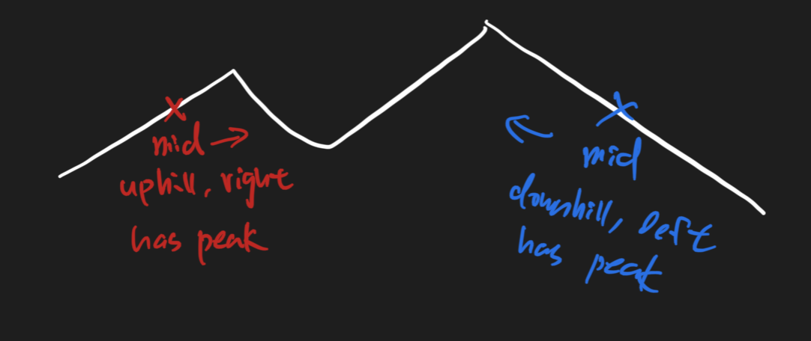

# Find Peak Element 75 \(M\)

## Problem

Description

There is an integer array which has the following features:

* The numbers in adjacent positions are different.
* A\[0\] &lt; A\[1\] && A\[A.length - 2\] &gt; A\[A.length - 1\].

We define a position P is a peak if:

```text
A[P] > A[P-1] && A[P] > A[P+1]
```

Find a peak element in this array. Return the index of the peak.

* It's guaranteed the array has at least one peak.
* The array may contain multiple peeks, find any of them.
* The array has at least 3 numbers in it.

Example

```text
Example 1:
	Input:  [1, 2, 1, 3, 4, 5, 7, 6]
	Output:  1 or 6
	
	Explanation:
	return the index of peek.


Example 2:
	Input: [1,2,3,4,1]
	Output:  3
```

## Solution



### Code



```python
class Solution:
    """
    @param A: An integers array.
    @return: return any of peek positions.
    """
    def findPeak(self, A):
        # write your code here
        
        start, end = 0, len(A) - 1
        while start + 1 < end:
            mid = (start + end)//2
            # if uphill
            if A[mid - 1] < A[mid] < A[mid + 1]:
                start = mid
            # if downhill
            else:
                end = mid
        if A[start] > A[mid]:
            return start
        return end
```



```

```



### Complexity Analysis

* **Time Complexity:O\(logn\)**
* **Space Complexity: O\(1\)**

