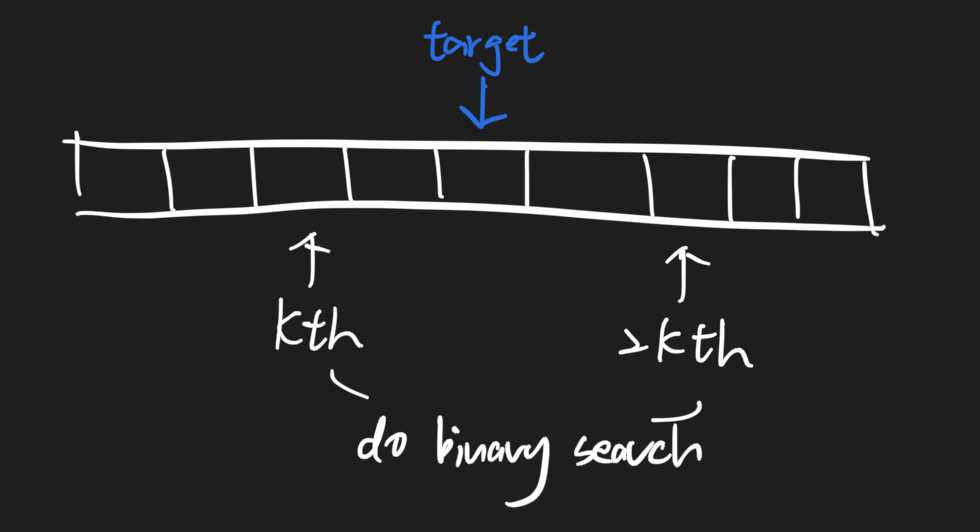

# Search in a Big Sorted Array 447 \(M\)

## Problem

Given a big sorted array with non-negative integers sorted by non-decreasing order. The array is so big so that you can not get the length of the whole array directly, and you can only access the kth number by `ArrayReader.get(k)` \(or ArrayReader-&gt;get\(k\) for C++\).

Find the first index of a target number. Your algorithm should be in O\(log k\), where k is the first index of the target number.

Return -1, if the number doesn't exist in the array.

If you accessed an inaccessible index \(outside of the array\), ArrayReader.get will return `2,147,483,647`.Example

**Example 1:**

```text
Input: [1, 3, 6, 9, 21, ...], target = 3
Output: 1
```

**Example 2:**

```text
Input: [1, 3, 6, 9, 21, ...], target = 4
Output: -1
```

Challenge

O\(logn\) time, n is the first index of the given target number.

## Solution - Binary Search



### Code



```python
class Solution:
    """
    @param reader: An instance of ArrayReader.
    @param target: An integer
    @return: An integer which is the first index of target.
    """
    def searchBigSortedArray(self, reader, target):
        # write your code here
        kth = 1
        while reader.get(kth - 1) < target:
            kth = kth * 2
        
        start, end = 0, kth - 1
        while start + 1 < end:
            mid = (start + end) // 2
            if reader.get(mid) < target:
                start = mid
            else:
                end = mid
        if reader.get(start) == target:
            return start
        if reader.get(end) == target:
            return end
        return -1
        
```



```

```



### Complexity Analysis

* **Time Complexity: O\(nlogn\)**
* **Space Complexity: O\(1\)**

