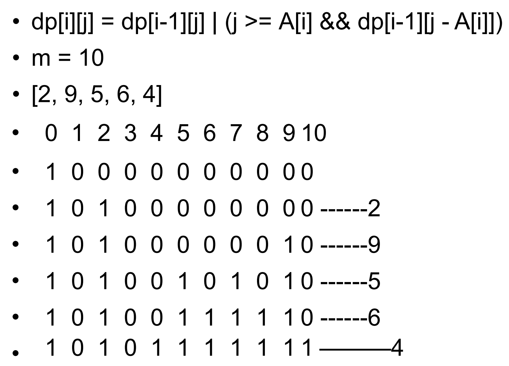

# Partition Equal Subset Sum 588 \(M\)

## Problem

Given a `non-empty` array containing `only positive integers`, find if the array can be partitioned into `two` subsets such that the sum of elements in both subsets is equal.

Each of the array element will not exceed 100.  
The array size will not exceed 200.Have you met this question in a real interview?  YesProblem Correction

#### Example

Example 1:

```text
Input: nums = [1, 5, 11, 5], 
Output: true
Explanation:
two subsets: [1, 5, 5], [11]
```

Example 2:

```text
Input: nums = [1, 2, 3, 9], 
Output: false
```

## Solution - DP \(1\)

In brute force, one way is to find all the subsets and then find whether any of it equals to sum\(total\)/2. However, that require O\(2^n\) times

If any num can be found, that mark as 1



### Code



```python
class Solution:
    """
    @param nums: a non-empty array only positive integers
    @return: true if can partition or false
    """
    def canPartition(self, nums):
        # write your code here
        if not nums:
            return False
        total = sum(nums)
        # if total is odd, can never find it
        if total%2 == 1:
            return False

        target = total//2
        n = len(nums)

        # dp[i][j] state means first ith items can form sum of j
        dp = [[False] * (target + 1) for _ in range(n + 1)]
        dp[0][0] = True
        for i in range(1, n + 1):
            for j in range(target + 1):
                if j >= nums[i - 1]:
                    dp[i][j] = dp[i - 1][j] or dp[i - 1][j - nums[i - 1]]
                else:
                    dp[i][j] = dp[i - 1][j] 
        
        return dp[n][target]
        
```



```

```



### Complexity Analysis

* **Time Complexity: O\(n \* m\)**
* **Space Complexity: O\(n \* m\)**

## Solution - DP \(2\)

Since every number whether it can be sums of subset or not, depend on previous state

State function can write as :

* dp\[j\] = dp\[j\] \| dp\[j - A\[i\]\]

### Code



```python
class Solution:
    """
    @param nums: a non-empty array only positive integers
    @return: true if can partition or false
    """
    def canPartition(self, nums):
        # write your code here
        if not nums:
            return False
        total = sum(nums)
        if total%2 == 1:
            return False
        
        target = total//2
        n = len(nums)
        
        # dp[i] means ith state, whether it can be the subset values or not
        dp = [False] * (target + 1)
        
        # init dp[0] as true
        dp[0] = True

        for i in range(n):
            for j in range(target, -1, -1):
                if j >= nums[i]:
                    dp[j] = dp[j] | dp[j - nums[i]]
        return dp[target]
            # should write as top down

            # WARNING!
            # if write as bottom up, would face that re-count the possibility
            # i.e: 
            # id: 0 1 2 3 4 5 6 7 8 
            #     1 0 1 0 0 0 0 0 0. ----- 2
            #     1 0 0 0 0 0 0 0 1. ----- 8
            #     1 0 0 1 0 1 0 0 0. ----- 3
            # the last line importing 3, if using bottom up solution, would count as
            
            #.    1 0 0 1 0 1 0 1 0, Here can see that 7 is mark as one
            #. since we reuse the 3 in 5 to count total as 7, that's not allowed
```



### Complexity Analysis

* **Time Complexity:**
* **Space Complexity:**

