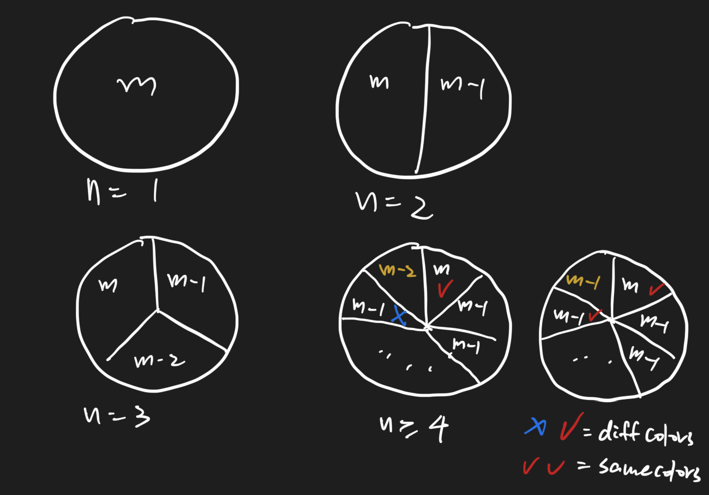

# Dyeing Problem 1444 \(M\)

## Problem

There is a circle, divided into `n` sectors. All the sectors are colored with some of `m` colors. The colors of adjacent sectors cannot be the same. Find the total number of plans.

* Do not consider symmetry.
* Since this number may be large, you only need to return the solution number mod `1e9 + 7`.
* 1 \leq n \leq 10^51≤n≤105
* 1 \leq m \leq 10^51≤m≤105

Example

**Example 1:**

```text
Input:n = 2,m = 3Output:6Explanation:One circle is divided into two sectors. There are six kinds of schemes for coloring in three colors: black, red, black and white, white and red, white and black, red and white, and red and black.
```

**Example 2:**

```text
Input:n = 3,m = 2Output:0Explanation:A circle is divided into 3 sectors and colored with 2 colors. No matter how it is colored, there is no guarantee that the adjacent colors are different.          
```

## Solution 



### Code



```python
MOD = 1e9 + 7
class Solution:
    """
    @param n: the number of sectors
    @param m: the number of colors
    @return: The total number of plans.
    """
    def getCount(self, n, m):
        # Write your code here
        
        dp = [0] * (n + 3)

        dp[1] = m % MOD
        dp[2] = m * (m - 1) % MOD
        dp[3] = m * (m - 1) * (m - 2) % MOD

        for i in range(4, n + 1):
            dp[i] += dp[i - 1] * (m - 2)
            dp[i] += dp[i - 2] * (m - 1)
            dp[i]%=MOD
        
        return int(dp[n])
```



### Complexity Analysis

* **Time Complexity:**
* **Space Complexity:**

