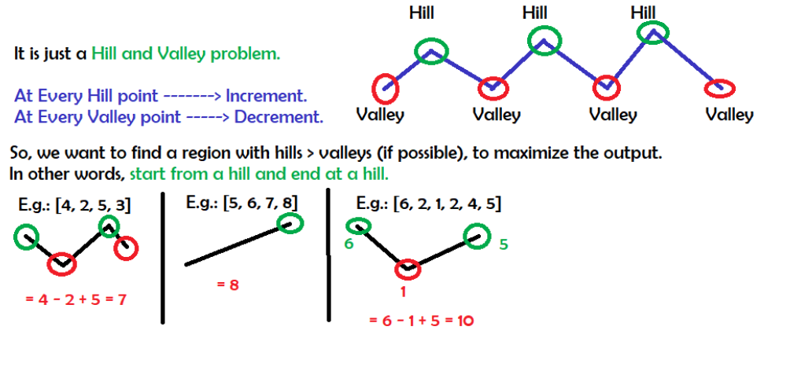

# Maximum Alternating Subsequence Sum \(LeetCode 1911\) \(M\)

## Problem

The **alternating sum** of a **0-indexed** array is defined as the **sum** of the elements at **even** indices **minus** the **sum** of the elements at **odd** indices.

* For example, the alternating sum of `[4,2,5,3]` is `(4 + 5) - (2 + 3) = 4`.

Given an array `nums`, return _the **maximum alternating sum** of any subsequence of_ `nums` _\(after **reindexing** the elements of the subsequence\)_.

* 
A **subsequence** of an array is a new array generated from the original array by deleting some elements \(possibly none\) without changing the remaining elements' relative order. For example, `[2,7,4]` is a subsequence of `[4,2,3,7,2,1,4]` \(the underlined elements\), while `[2,4,2]` is not.

**Example 1:**

```text
Input: nums = [4,2,5,3]
Output: 7
Explanation: It is optimal to choose the subsequence [4,2,5] with alternating sum (4 + 5) - 2 = 7.
```

**Example 2:**

```text
Input: nums = [5,6,7,8]
Output: 8
Explanation: It is optimal to choose the subsequence [8] with alternating sum 8.
```

**Example 3:**

```text
Input: nums = [6,2,1,2,4,5]
Output: 10
Explanation: It is optimal to choose the subsequence [6,1,5] with alternating sum (6 + 5) - 1 = 10.
```

**Constraints:**

* `1 <= nums.length <= 105`
* `1 <= nums[i] <= 105`

## Solution - Peak / Valley



### Code



```python
class Solution:
    def maxAlternatingSum(self, nums: List[int]) -> int:
        ans = 0
        direction = 'down'
        n = len(nums)
        for i in range(n - 1):
            if direction == 'down' and nums[i] >= nums[i + 1]:
                ans+=nums[i]
                direction = 'up'
            elif direction == 'up' and nums[i] <= nums[i + 1]:
                ans -= nums[i]
                direction = 'down'
        if direction == 'up':
            # dones't need to include the last one
            return ans
        # need to include the last one
        return ans + nums[-1]
```



### Complexity Analysis

* **Time Complexity: O\(n\)**
* **Space Complexity: O\(1\)**

## Solution - DP

### Code



```python
class Solution:
    def maxAlternatingSum(self, nums: List[int]) -> int:
        n = len(nums)
        dp = [0] * n
        dp[0] = nums[0]
        for i in range(1, n):
            dp[i] = dp[i - 1] + max(0, nums[i] - nums[i - 1])
        return dp[n - 1]
```



### Complexity Analysis

* **Time Complexity: O\(n\)**
* **Space Complexity: O\(n\)**

## Solution - DP with scrolling arrays

### Code



```python
import heapq
class Solution:
    def maxAlternatingSum(self, nums: List[int]) -> int:
        n = len(nums)
        dp = [0] * 2
        dp[0] = nums[0]
        for i in range(1, n):
            dp[i%2] = dp[(i - 1)%2] + max(0, nums[i] - nums[i - 1])
        return dp[(n - 1)%2]
```



### Complexity Analysis

* **Time Complexity: O\(n\)**
* **Space Complexity: O\(1\)**

