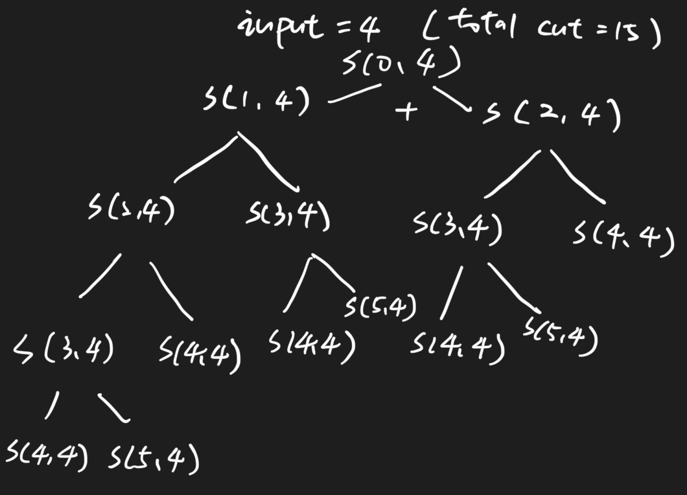
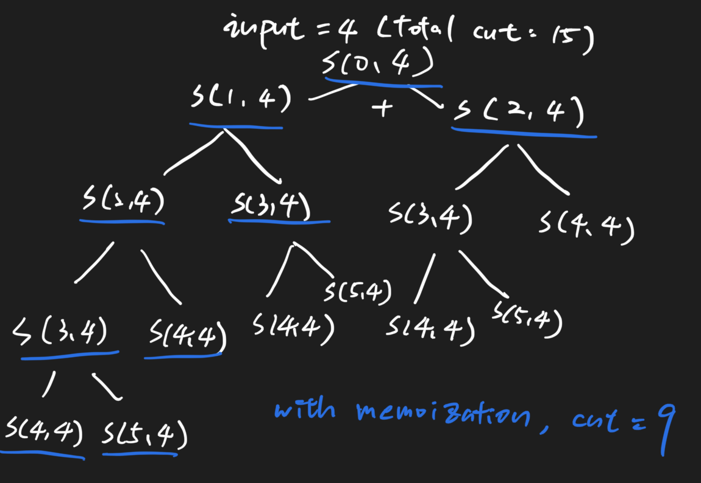

# Climbing Stairs 111 \(E\)

## Problem

You are climbing a stair case. It takes **n** steps to reach to the top.

Each time you can either climb 1 or 2 steps. In how many distinct ways can you climb to the top?Example

```text
Example 1:
	Input:  n = 3
	Output: 3
	
	Explanation:
	1) 1, 1, 1
	2) 1, 2
	3) 2, 1
	total 3.


Example 2:
	Input:  n = 1
	Output: 1
	
	Explanation:  
	only 1 way.
```

## Solution - Recursion



### Code



```python
class Solution:
    """
    @param n: An integer
    @return: An integer
    """
    def climbStairs(self, n):
        # write your code here
        memory = {}
        res = self.search(n, memory)
        return res
    def search(self, n, memory):
        if n in memory:
            return memory[n]
        if n < 3:
            return n
        res = self.search(n - 1, memory) + self.search(n - 2, memory)
        memory[n] = res
        return res
```



```python
class Solution:
    """
    @param n: An integer
    @return: An integer
    """
    def climbStairs(self, n):
        # write your code here
        if n < 3:
             return n
        return self.search(0, n)
    def search(self, i, n):
        if i > n:
            return 0
        if i == n:
            return 1
        return self.search(i + 1, n) + self.search(i + 2, n)
```



```python
class Solution:
    """
    @param n: An integer
    @return: An integer
    """
    def climbStairs(self, n):
        # write your code here
        if n < 3:
             return n
        cnt = [0]
        res = self.search(0, n, cnt)
        print(cnt[0]) # input: 5 / cnt = 25
        return res
    def search(self, i, n, cnt):
        cnt[0]+=1
        if i > n:
            return 0
        if i == n:
            return 1
        return self.search(i + 1, n, cnt) + self.search(i + 2, n, cnt)
```



### Complexity Analysis

* **Time Complexity: O\(2^n\) \(Roughly\)**
* **Space Complexity: O\(n\)**
  * call stack frame: O\(n\)
  * HashMap: O\(n\)

## Solution - Recursion with Memoization



### Code



```python
class Solution:
    """
    @param n: An integer
    @return: An integer
    """
    def climbStairs(self, n):
        # write your code here
        # memoization
        memory = {}
        res = self.search(n, memory)
        return res
    def search(self, n, memory):
        if n in memory:
            return memory[n]
        if n < 3:
            return n
        res = self.search(n - 1, memory) + self.search(n - 2, memory)
        memory[n] = res
        return res
```



```python
class Solution:
    """
    @param n: An integer
    @return: An integer
    """
    def climbStairs(self, n):
        # write your code here
        if n < 3:
             return n
        memory = {}
        return self.search(0, n, memory)
    def search(self, i, n, memory):
        if i > n:
            return 0
        if i == n:
            return 1
        if i in memory:
            return memory[i]
        memory[i] = self.search(i + 1, n, memory) + self.search(i + 2, n, memory)
        return memory[i]
```



```python
class Solution:
    """
    @param n: An integer
    @return: An integer
    """
    def climbStairs(self, n):
        # write your code here
        if n < 3:
             return n
        memory = {}
        cnt = [0]
        res = self.search(0, n, memory, cnt)
        print(cnt[0]) # input: 5 / cnt = 11
        return res
    def search(self, i, n, memory, cnt):
        cnt[0]+=1
        if i > n:
            return 0
        if i == n:
            return 1
        if i in memory:
            return memory[i]
        memory[i] = self.search(i + 1, n, memory, cnt) + self.search(i + 2, n, memory, cnt)
        return memory[i]
```



### Complexity Analysis

* **Time Complexity: O\(n\)**
* **Space Complexity: O\(n\)**
  * Call stack frame: O\(n\)
  * HashMap: O\(n\)

\*\*\*\*

## Solution - DP

### Code



```python
class Solution:
    """
    @param n: An integer
    @return: An integer
    """
    def climbStairs(self, n):
        # write your code here
        if n < 3:
            return n
        
        # dp[i]: the total solutions num for first ith number
        dp = [0] * (n + 1)

        dp[1] = 1
        dp[2] = 2
        for i in range(3, n + 1):
            dp[i] = dp[i - 1] + dp[i - 2]
        return dp[n]
```



```

```



### Complexity Analysis

* **Time Complexity: O\(n\)**
* **Space Complexity: O\(n\)**

\*\*\*\*

## Solution - DP with Strolling Arrays

### Code



```python
class Solution:
    """
    @param n: An integer
    @return: An integer
    """
    def climbStairs(self, n):
        # write your code here
        if n < 3:
            return n
        # dp solution (strolling array optimization)
        # dp[i]: the total solutions num for first ith number
        dp = [0] * (3)

        dp[1] = 1
        dp[2] = 2
        for i in range(3, n + 1):
            dp[i%3] = dp[(i - 1)%3] + dp[(i - 2)%3]
        return dp[n%3]
```



```

```



### Complexity Analysis

* **Time Complexity: O\(n\)**
* **Space Complexity: O\(1\)**

\*\*\*\*

## Solution - Search 2

### Code



```python
class Solution:
    """
    @param n: An integer
    @return: An integer
    """
    def climbStairs(self, n):
        # write your code here
        if n < 3:
            return n
        res = [0]
        self.search(n, res)
        return res[0]
    
    def search(self, n, res):
        if n == 0:
            res[0]+=1
            return 
        if n < 0:
            return
        self.search(n - 1, res)
        self.search(n - 2, res)`
```



```python
class Solution:
    """
    @param n: An integer
    @return: An integer
    """
    def climbStairs(self, n):
        # write your code here
        if n < 3:
            return n
        res = [0]
        self.search(0, n, res)
        return res[0]
    
    def search(self, index, n, res):
        if index == n:
            res[0]+=1
            return 
        if index > n:
            return
        self.search(index + 1, n, res)
        self.search(index + 2, n, res)
```



### Complexity Analysis

* **Time Complexity:**
* **Space Complexity:**

