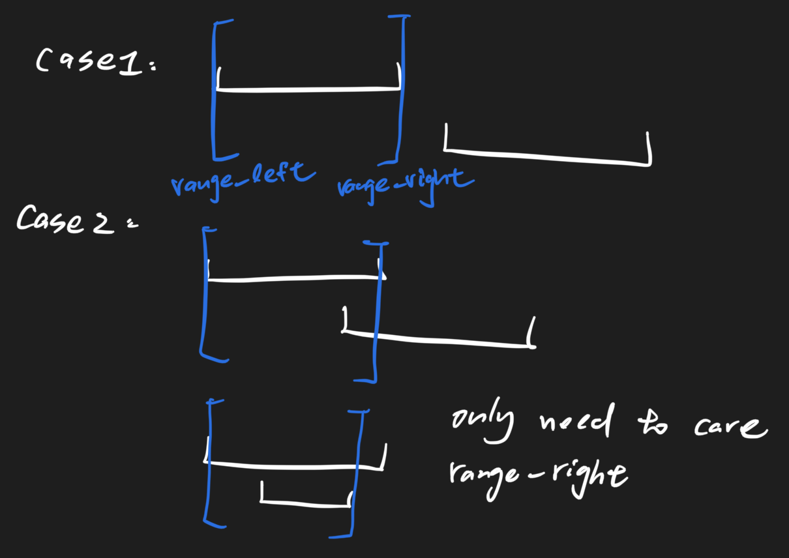

# Interval Minimum Coverage 1668 \(M\)

## Problem

There are `n` intervals in number axis. Now we need to choose some points to make that there is at least one point in each interval.

Return the minimum number of chosen points.

1. `1 <= n <= 10^4`
2. We guarantee that the given intervals are valid and the left and right endpoints of each interval are within the range of `[0, 10 ^ 5]`.
3. They are closed intervals.

Example

**Example 1:**

```text
Input: [(1,5), (4,8), (10,12)]
Output: 2
Explanation: 
  Choose two points: 5, 10
  The first  interval [1, 5] contains 5
  The second interval [4, 8] contains 5
  The third  interval [10, 12] contains 10
```

**Example 2:**

```text
Input: [(1,5), (4,8), (5,12)]
Output: 1
Explanation: All intervals contain 5
```

## Solution



### Code



```python
"""
Definition of Interval.
class Interval(object):
    def __init__(self, start, end):
        self.start = start
        self.end = end
"""

class Solution:
    """
    @param a: the array a
    @return: return the minimal points number
    """
    def getAns(self, a):
        # write your code here
        a.sort(key = lambda n : (n.start, n.end))
        range_left, range_right = a[0].start, a[0].end
        res = 1
        for i in range(1, len(a)):
            if a[i].start <= range_right:
                range_right = min(range_right, a[i].end)
            else:
                res+=1
                range_left = a[i].start
                range_right = a[i].end
        return res
        
```



```

```



### Complexity Analysis

* **Time Complexity:**
* **Space Complexity:**

