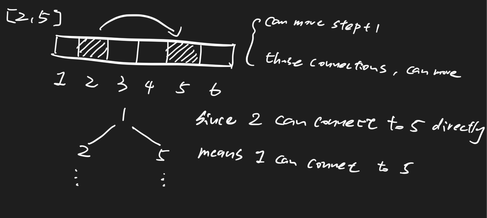

# Modern Ludo I 1565 \(M\)

## Problem

There is a one-dimensional board with a starting point on the far left side of the board and an end point on the far right side of the board. There are several positions on the board that are connected to other positions, ie if A is connected to B, then when chess falls at position A, you can choose whether to give up to throw dice and move the chess from A to B directly. And the connection is one way, which means that the chess cannot move from B to A. Now given the `length` and `connections` of the board, and you have a six-sided dice\(1-6\), output the minimum steps to reach the end point.

* the index starts from 1.
* length &gt; 1
* The starting point is not connected to any other location
* connections\[i\]\[0\] &lt; connections\[i\]\[1\]

Example

**Example1**

```text
Input: length = 10 and connections = [[2, 10]]Output: 1Explanation: 1->2 (dice)2->10(for free)
```

**Example2**

```text
Input: length = 15 and connections = [[2, 8],[6, 9]]Output: 2Explanation: 1->6 (dice)6->9 (for free)9->15(dice)
```

## Solution - BFS + BFS

The outer BFS determine the shortest path 

The inner BFS do the traverse \(and take care those visited/unvisited\) path



### Code



```python
class Solution:
    """
    @param length: the length of board
    @param connections: the connections of the positions
    @return: the minimum steps to reach the end
    """
    # total time complexity: O(n + m)
    def modernLudo(self, length, connections):
        # Write your code here
        graph = self.build_graph(length, connections)
        
        # index start from 1
        queue = collections.deque([1])
        distance = {1 : 0}
        while queue:
            node = queue.popleft()
            # since six_sided dice (1-6), maximum can only reach node + 6
            for neighbor in range(node + 1, min(node + 7, length + 1)):
                # all the connected nodes, that should also be considered as distance + 1
                connected_nodes = self.get_unvisited_nodes(graph, distance, neighbor)
                for connected_node in connected_nodes:
                    distance[connected_node] = distance[node] + 1
                    queue.append(connected_node)
        return distance[length]

    # to improve algorithm efficiency, those visited nodes should not visited again
    def get_unvisited_nodes(self, graph, distance, node):
        queue = collections.deque([node])
        unvisited_nodes = set()
        while queue:
            node = queue.popleft()
            if node in distance: 
                continue
            unvisited_nodes.add(node)
            for neighbor in graph[node]:
                if neighbor not in distance:
                    queue.append(neighbor)
                    unvisited_nodes.add(neighbor)
        return unvisited_nodes
        

    def build_graph(self, length, connections):
        graph = {i : set() for i in range(1, length + 1)}
        for a, b in connections:
            graph[a].add(b)
        return graph
```



### Complexity Analysis

* **Time Complexity: O\(N + E\)**
  * N: nodes amount
  * E: edges amount
* **Space Complexity:** 

\*\*\*\*

## Solution - Double Queue

### Code



```python
class Solution:
    """
    @param length: the length of board
    @param connections: the connections of the positions
    @return: the minimum steps to reach the end
    """
    # total time complexity: O(n + m)
    def modernLudo(self, length, connections):
        # Write your code here
        graph = self.build_graph(length, connections)
        
        # index start from 1
        queue = [1]
        distance = {1 : 0}
        while queue:
            next_queue = []
            for node in queue:
                # find all the connected nodes, for the same level
                for direct_node in graph[node]:
                    if direct_node in distance:
                        continue
                    distance[direct_node] = distance[node]
                    queue.append(direct_node)
            
            # find the next level and put nodes into next_queue
            for node in queue:
                for next_node in range(node + 1, min(node + 7, length + 1)):
                    if next_node in distance:
                        continue
                    distance[next_node] = distance[node] + 1
                    next_queue.append(next_node)
            queue = next_queue
        
        return distance[length]
        
    def build_graph(self, length, connections):
        graph = {i : set() for i in range(1, length + 1)}
        for a, b in connections:
            graph[a].add(b)
        return graph
```



### Complexity Analysis

* **Time Complexity:**
* **Space Complexity:**

## Solution - SPFA

SPFA \(shortest Path Faster Algorithm\): 

* Design to solve complex graph problems

### Code



```python
class Solution:
    """
    @param length: the length of board
    @param connections: the connections of the positions
    @return: the minimum steps to reach the end
    """
    # total time complexity: O(n + m)
    def modernLudo(self, length, connections):
        # Write your code here
        graph = self.build_graph(length, connections)
        
        # index start from 1
        queue = collections.deque([1])
        distance = { i: float('inf') for i in range(1, length + 1)}

        distance[1] = 0

        while queue:
            node = queue.popleft()
            for next_node in graph[node]:
                # only when the distance get shorter, than put back to queue
                if distance[next_node] > distance[node]:
                    distance[next_node] = distance[node]
                    queue.append(next_node)
            for next_node in range(node + 1, min(node + 7, length + 1)):
                # only when the distance get shorter, than put back to queue
                if distance[next_node] > distance[node] + 1:
                    distance[next_node] = distance[node] + 1
                    queue.append(next_node)
        
        return distance[length]
        
    def build_graph(self, length, connections):
        graph = {i : set() for i in range(1, length + 1)}
        for a, b in connections:
            graph[a].add(b)
        return graph
```



### Complexity Analysis

* **Time Complexity: Can reach O\(n^2 \* m\)**
* **Space Complexity:**

## Solution - SPFA Optimization

To even faster find the shortest path, use min\_heap to reduce the searching time

### Code



```python
import heapq
class Solution:
    """
    @param length: the length of board
    @param connections: the connections of the positions
    @return: the minimum steps to reach the end
    """
    # total time complexity: O(n + m)
    def modernLudo(self, length, connections):
        # Write your code here
        graph = self.build_graph(length, connections)
        
        # index start from 1
        queue = [(0, 1)]
        distance = { i: float('inf') for i in range(1, length + 1)}

        distance[1] = 0

        while queue:
            dist, node = heapq.heappop(queue)
            for next_node in graph[node]:
                if distance[next_node] > dist:
                    distance[next_node] = dist
                    heapq.heappush(queue, (dist, next_node))
            for next_node in range(node + 1, min(node + 7, length + 1)):
                if distance[next_node] > dist + 1:
                    distance[next_node] = dist + 1
                    heapq.heappush(queue, (dist + 1, next_node))
        
        return distance[length]
        
    def build_graph(self, length, connections):
        graph = {i : set() for i in range(1, length + 1)}
        for a, b in connections:
            graph[a].add(b)
        return graph
```



### Complexity Analysis

* **Time Complexity:**
* **Space Complexity:**

## Solution - DP

### Code



```python
import heapq
class Solution:
    """
    @param length: the length of board
    @param connections: the connections of the positions
    @return: the minimum steps to reach the end
    """
    # total time complexity: O(n + m)
    def modernLudo(self, length, connections):
        # Write your code here
        graph = self.build_graph(length, connections)
        
        # dp state: from i to j, how many minimum steps required
        dp = [float('inf')] * (length + 1)
        dp[length] = 0
        for i in range(length - 1, 0, -1):
            # via dice (1 ~ 6)
            for j in range(i + 1, min(i + 7, length + 1)):
                dp[i] = min(dp[i], dp[j] + 1)
            # via connections
            for j in graph[i]:
                dp[i] = min(dp[i], dp[j])
        return dp[1]
        
    def build_graph(self, length, connections):
        graph = {i : set() for i in range(1, length + 1)}
        for a, b in connections:
            graph[a].add(b)
        return graph
```



### Complexity Analysis

* **Time Complexity:**
* **Space Complexity:**


