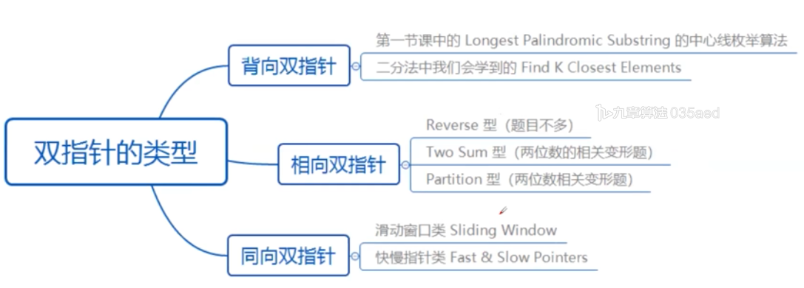

# Two Pointer

## Two Pointer Application 

## Partition Template


Need to write as left &lt;= right, but not left &lt; right

Because after while loop, if write `<=`, would gaurantee left is in the first element of right parts


