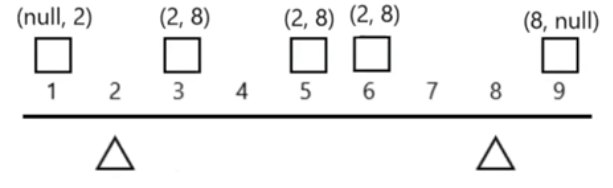

# Heaters 1219 \(M\)

## Problem

Winter is coming! Your first job during the contest is to design a standard heater with fixed warm radius to warm all the houses.

Now, you are given positions of houses and heaters on a horizontal line, find out minimum radius of heaters so that all houses could be covered by those heaters.

So, your input will be the positions of houses and heaters seperately, and your expected output will be the minimum radius standard of heaters.

1.Numbers of houses and heaters you are given are non-negative and will not exceed 25000.  
2.Positions of houses and heaters you are given are non-negative and will not exceed 10^9.  
3.As long as a house is in the heaters' warm radius range, it can be warmed.  
4.All the heaters follow your radius standard and the warm radius will the same.Example

**Example 1:**

```text
Input: [1,2,3],[2]
Output: 1
Explanation: The only heater was placed in the position 2, and if we use the radius 1 standard, then all the houses can be warmed.
```

**Example 2:**

```text
Input: [1,2,3,4],[1,4]
Output: 1
Explanation: The two heater was placed in the position 1 and 4. We need to use radius 1 standard, then all the houses can be warmed.
```

## Solution - Binary Search

When house choosing heater, must be following two cases:

* Left last one heater &lt;= house location 
* Right first one heater &gt;= house location



### Code



```python
class Solution:
    """
    @param houses: positions of houses
    @param heaters: positions of heaters
    @return: the minimum radius standard of heaters
    """
    def findRadius(self, houses, heaters):
        # Write your code here
        
        # sort the heaters, since we want to find the house position inside heaters 
        heaters.sort()

        heat_radius = 0
        for house in houses:
            radius = self.get_minimum_radius(house, heaters)
            heat_radius = max(heat_radius, radius)
        return heat_radius
    
    def get_minimum_radius(self, house, heaters):
        left, right = 0, len(heaters) - 1
        while left + 1 < right:
            mid = (left + right)//2
            if heaters[mid] <= house:
                left = mid
            else:
                right = mid
        
        # find answer btw left/right
        left_distance = abs(heaters[left] - house)
        right_distance = abs(heaters[right] - house)

        return min(left_distance, right_distance)

```



### Complexity Analysis

* **Time Complexity: O\(\(n+m\)\*logm\)**
  * Sort: O\(mlogm\)
  * Traverse + Binary search: O\(n \* logm\)
* **Space Complexity: O\(n\)**

\*\*\*\*

## Solution 

### Code



```python

```



### Complexity Analysis

* **Time Complexity:**
* **Space Complexity:**

