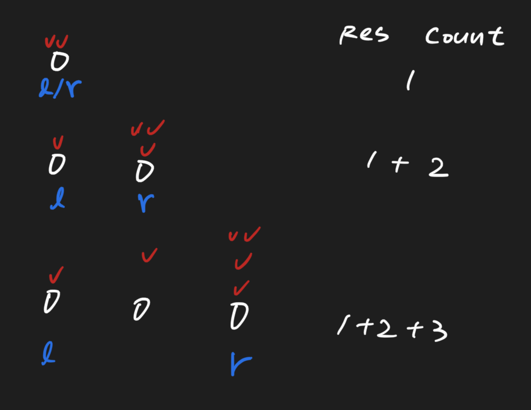

# Interval Statistics 1667 \(M\)

## Problem

Given `arr`, an array of 01 and an integer `k`. You need to count how many intervals meet the following conditions:

1. Both start and the end of the interval are 0 \(allowing the length of the interval to be 1\).
2. The number of 1 in the interval is not more than `k`

The length of `arr` does not exceed `10^5`Example

**Example 1:**

```text
Input: arr = [0, 0, 1, 0, 1, 1, 0], k = 1
Output: 7
Explanation: [0, 0], [1, 1], [3, 3], [6, 6], [0, 1], [0, 3], [1, 3] (The interval [i, j] means the elements between index i(included) and index j(included))
```

**Example 2:**

```text
Input: arr = [1, 1, 1, 0, 0, 1], k = 2
Output: 3
Explanation: [3, 3], [4, 4], [3, 4] (The interval [i, j] means the elements between index i(included) and index j(included))
```

## Solution

Two pointers \(left, right\), and always move the right pointer, and record how many 1 between right / left pointer. Right pointer should stop once encounter 0, and if 1 just continue traverse toward right



### Code



```python
class Solution:
    """
    @param arr: the 01 array
    @param k: the limit 
    @return: the sum of the interval
    """
    def intervalStatistics(self, arr, k):
        # Write your code here.
        if not arr:
            return 0

        left, right = 0, 0
        num_of_one, res = 0, 0

        while right < len(arr):
            # if 1, keep traverse toward right
            if arr[right] == 1:
                right+=1
                num_of_one+=1
                continue
            
            # once encounter 0, judge how many 1 btw right/left pointer            
            while num_of_one > k:
                if arr[left] == 1:
                    num_of_one-=1
                left+=1
            
            # add res
            res+= right - left + 1 - num_of_one
            right+=1
        return res
        
```



```

```



### Complexity Analysis

* **Time Complexity:**
* **Space Complexity:**

