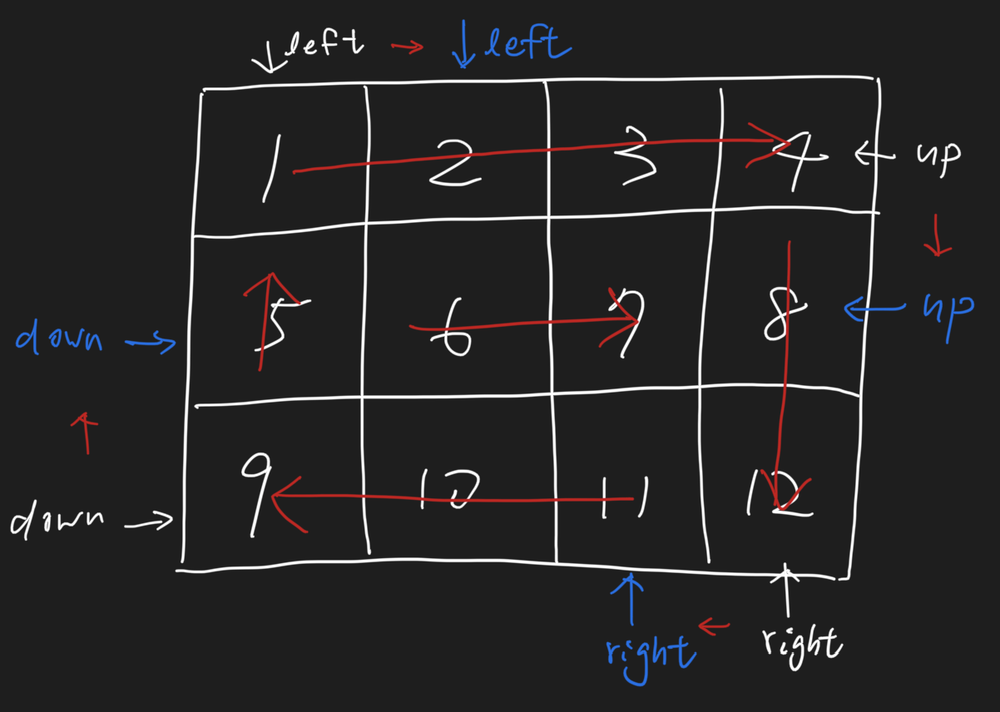

# Spiral Matrix 374 \(M\)

## Problem

Given an `m x n` `matrix`, return _all elements of the_ `matrix` _in spiral order_.

**Example 1:**

```text
Input: matrix = [[1,2,3],[4,5,6],[7,8,9]]
Output: [1,2,3,6,9,8,7,4,5]
```

**Example 2:**

```text
Input: matrix = [[1,2,3,4],[5,6,7,8],[9,10,11,12]]
Output: [1,2,3,4,8,12,11,10,9,5,6,7]
```

**Constraints:**

* `m == matrix.length`
* `n == matrix[i].length`
* `1 <= m, n <= 10`
*   

## Solution - Simulation





```python
class DIRECTION:
    RIGHT = 0
    DOWN = 1
    LEFT = 2
    UP = 3
    
class Solution:
    """
    @param matrix: a matrix of m x n elements
    @return: an integer list
    """
    def spiralOrder(self, matrix):
        # write your code here
        if not matrix or not matrix[0]:
            return []
        
        up = 0
        left = 0
        right = len(matrix[0]) - 1
        down = len(matrix) - 1
        res = []

        direct = DIRECTION.RIGHT

        while True:
            if direct == DIRECTION.RIGHT:
                for i in range(left, right + 1):
                    res.append(matrix[up][i])
                up+=1
            if direct == DIRECTION.DOWN:
                for i in range(up, down + 1):
                    res.append(matrix[i][right])
                right-=1
            if direct == DIRECTION.LEFT:
                for i in range(right, left - 1, -1):
                    res.append(matrix[down][i])
                down -=1
            if direct == DIRECTION.UP:
                for i in range(down, up - 1, -1):
                    res.append(matrix[i][left])
                left+=1
            if up > down or left > right:
                return res
            direct = (direct + 1)%4
```



### Complexity Analysis

* **Time Complexity:**
* **Space Complexity:**

\*\*\*\*

## Solution 



```python

```



### Complexity Analysis

* **Time Complexity:**
* **Space Complexity:**

