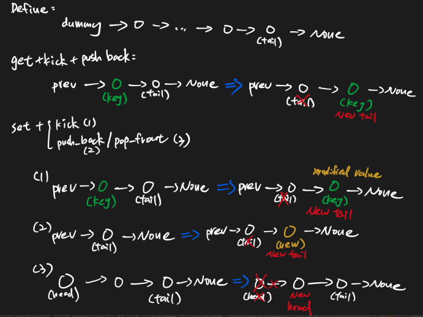

# LRU Cache 134 \(H\)

## Problem

Design and implement a data structure for Least Recently Used \(LRU\) cache. It should support the following operations: `get` and `set`.

* `get(key)` Get the value \(will always be positive\) of the key if the key exists in the cache, otherwise return -1.
* `set(key, value)` Set or insert the value if the key is not already present. When the cache reached its capacity, it should invalidate the least recently used item before inserting a new item.

Finally, you need to return the data from each get.Example

**Example1**

```text
Input:
LRUCache(2)
set(2, 1)
set(1, 1)
get(2)
set(4, 1)
get(1)
get(2)
Output: [1,-1,1]
Explanation：
cache cap is 2，set(2,1)，set(1, 1)，get(2) and return 1，set(4,1) and delete (1,1)，because （1,1）is the least use，get(1) and return -1，get(2) and return 1.
```

**Example 2:**

```text
Input：
LRUCache(1)
set(2, 1)
get(2)
set(3, 2)
get(2)
get(3)
Output：[1,-1,2]
Explanation：
cache cap is 1，set(2,1)，get(2) and return 1，set(3,2) and delete (2,1)，get(2) and return -1，get(3) and return 2.
```

## Solution

Using singly-linkedlist and hashmap to record the previous node

* Since linked list access O\(1\) \(with hashmap\), and if out of size, linkedlist can do in O\(1\) deleting node as well
  * Even array can do O\(1\) access, but deleting first node require O\(n\) adjusting values in rest positions
* With hashmap don't need to implement doubly linkedlist



### Code



```python
class LinkedNode:
    def __init__(self, key = None, value = None, next = None):
        self.key = key
        self.value = value
        self.next = next

class LRUCache:
    """
    @param: capacity: An integer
    """
    def __init__(self, capacity):
        # do intialization if necessary
        self.key_to_prev = {}
        self.dummy = LinkedNode()
        self.tail = self.dummy
        self.capacity = capacity
    
    def push_back(self, node):
        self.key_to_prev[node.key] = self.tail
        self.tail.next = node
        self.tail = node
    # change "prev->node->next->...->tail"
    # to "prev->next->...->tail->node"
    def kick(self, prev):
        node = prev.next
        if node == self.tail:
            return 
        # remove cur node from linked-list
        prev.next = node.next
        # update previous node in hash map
        self.key_to_prev[node.next.key] = prev
        node.next = None

        self.push_back(node)

    """
    @param: key: An integer
    @return: An integer
    """
    def get(self, key):
        # write your code here
        if key not in self.key_to_prev:
            return -1
        prev = self.key_to_prev[key]
        cur = prev.next

        self.kick(prev)
        return cur.value
    
    def pop_front(self):
        head = self.dummy.next
        del self.key_to_prev[head.key]
        self.dummy.next = head.next
        self.key_to_prev[head.next.key] = self.dummy
    """
    @param: key: An integer
    @param: value: An integer
    @return: nothing
    """
    def set(self, key, value):
        # write your code here
        if key in self.key_to_prev:
            self.kick(self.key_to_prev[key])
            self.tail.value = value
            return
        
        self.push_back(LinkedNode(key, value))
        # the size of hashmap equals to linkedlist length
        if len(self.key_to_prev) > self.capacity:
            self.pop_front()

```



```

```



### Complexity Analysis

* **Time Complexity: O\(1\)**
* **Space Complexity: O\(1\)**

