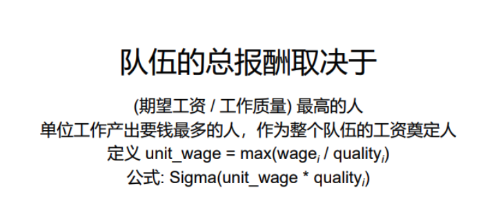
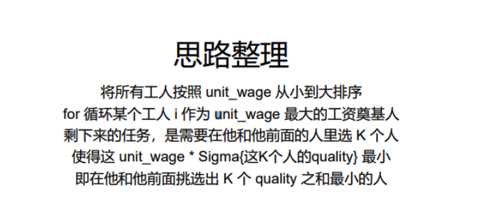
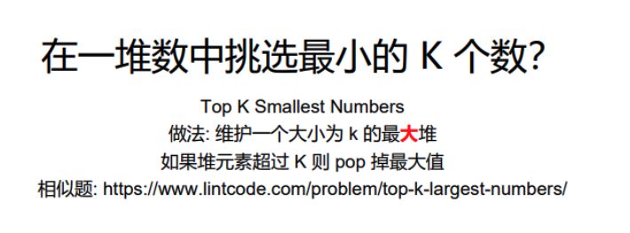

# Minimum Cost to Hire K Workers 1512 \(H\)

## Problem

There are `N` workers. The `i`-th worker has a `quality[i]` and a minimum wage expectation `wage[i]`.

Now we want to hire exactly K workers to form a paid group. When hiring a group of K workers, we must pay them according to the following rules:

* Every worker in the paid group should be paid in the ratio of their quality compared to other workers in the paid group.
* Every worker in the paid group must be paid at least their minimum wage expectation.

Return the least amount of money needed to form a paid group satisfying the above conditions.

1.`1 <= K <= N <= 10000`, where `N = quality.length = wage.length`  
2.`1 <= quality[i] <= 10000`  
3.`1 <= wage[i] <= 10000`  
4.Answers within `10^-5` of the correct answer will be considered correct.Example

**Example 1:**

```text
Input: quality = [10,20,5], wage = [70,50,30], K = 2Output: 105.00000Explanation: We pay 70 to 0-th worker and 35 to 2-th worker.
```

**Example 2:**

```text
Input: quality = [3,1,10,10,1], wage = [4,8,2,2,7], K = 3Output: 30.66667Explanation: We pay 4 to 0-th worker, 13.33333 to 2-th and 3-th workers seperately. 
```

## Solution 







### Code



```python
import heapq
class Solution:
    """
    @param quality: an array
    @param wage: an array
    @param K: an integer
    @return: the least amount of money needed to form a paid group
    """
    def mincostToHireWorkers(self, quality, wage, K):
        # Write your code here
        n = len(quality)

        # sorting, lower unit wage to the front, if same unit wage, then less work quality in the front
        workers = sorted([w / q, q] for w, q in zip(wage, quality))

        min_cost = float('inf')
        team_quality = 0
        heap = []
        for unit_wage, quality in workers:
            # remove heap top 
            if len(heap) == K:
                team_quality -= -heapq.heappop(heap)
            # calculate the team whole quality
            team_quality+=quality
            heapq.heappush(heap, -quality)

            if len(heap) == K:
                # since the unit_wage is sorted (from small to large), therefore, the later unit_wage gaurantee satify the former member minmum wage 
                min_cost = min(min_cost, team_quality * unit_wage)
        return min_cost

```



### Complexity Analysis

* **Time Complexity: O\(nlogn\)**
  * sort\(\): O\(nlogn\)
  * traverse and heap: O\(nlogk\)
* **Space Complexity: O\(n\)**

