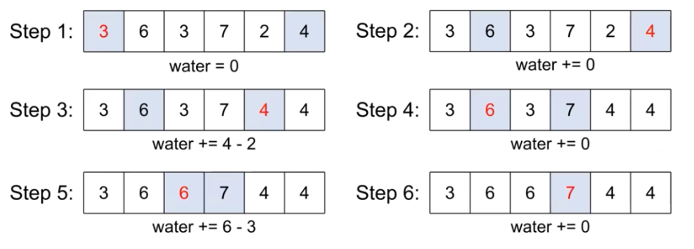
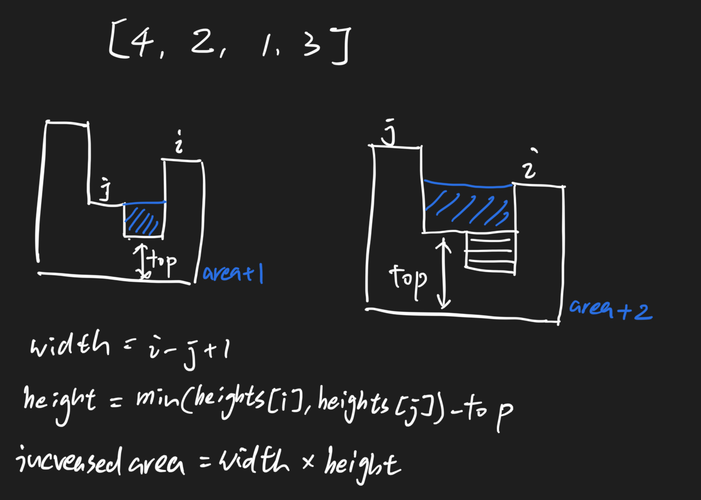

# Trapping Rain Water 363 \(M\)

## Problem

Given _n_ non-negative integers representing an elevation map where the width of each bar is `1`, compute how much water it is able to trap after raining.

Example

**Example 1:**

```text
Input: [0,1,0]Output: 0
```

**Example 2:**

```text
Input: [0,1,0,2,1,0,1,3,2,1,2,1]Output: 6
```

Challenge

O\(n\) time and O\(1\) memory

O\(n\) time and O\(n\) memory is also acceptable.

## Solution - Brute Force 

Traverse every position, and that position's possible water area would be:

* min\(right_max, leftmax\)  - heights\[i\] \* 1 \(the width\)_
* Right Max: from current position looks right, the max value
* Left Max: from current position looks left, the max value

### Code



```python
class Solution:
    """
    @param heights: a list of integers
    @return: a integer
    """
    def trapRainWater(self, heights):
        # write your code here
        if not heights:
            return 0
        res = 0
        for i in range(len(heights)):
            left_max = self.find_max(heights, i, False)
            right_max = self.find_max(heights, i, True)
            res+=min(left_max, right_max) - heights[i]
        return res
    
    def find_max(self, heights, cur, right_see):
        if right_see:
            if cur < len(heights) - 1:
                return max(max(heights[cur + 1:]), heights[cur])
            else:
                return heights[cur]
        else:
            if cur > 0:
                # WARNING! should not write as [cur - 1:-1:-1]
                return max(max(heights[cur - 1::-1]), heights[cur])
            else:
                return heights[cur]
```



```python
# Cleaner Solution!
class Solution:
    """
    @param heights: a list of integers
    @return: a integer
    """
    def trapRainWater(self, heights):
        # write your code here
        area = 0
        for i in range(len(heights)):
            right_max = heights[i]
            for j in range(i + 1, len(heights)):
                right_max = max(right_max, heights[j])
            left_max = heights[i]
            for j in range(i - 1, -1, -1):
                left_max = max(left_max, heights[j])
            area += min(right_max,left_max) - heights[i]
        return area
```



### Complexity Analysis

* **Time Complexity: O\(n^2\)**
* **Space Complexity: O\(1\)**


In this approach, actually when finding max, we redundantly traverse the elements in list


## Solution - Prefix Max 

### Code



```python
class Solution:
    """
    @param heights: a list of integers
    @return: a integer
    """
    def trapRainWater(self, heights):
        # write your code here
        area = 0
        if not heights:
            return area
        n = len(heights)
        right_max, left_max = [0] * n, [0] * n
        
        left_max[0] = heights[0]
        for i in range(1, n):
            left_max[i] = max(left_max[i - 1], heights[i])

        right_max[n - 1] = heights[n - 1]
        for i in range(n - 2, -1, -1):
            right_max[i] = max(right_max[i + 1], heights[i])

        for i in range(n):
            area += min(left_max[i], right_max[i]) - heights[i]
        
        return area
```



### Complexity Analysis

* **Time Complexity: O\(n\)**
* **Space Complexity: O\(n\)**

## Solution - Two Pointer



### Code



```python
class Solution:
    """
    @param heights: a list of integers
    @return: a integer
    """
    def trapRainWater(self, heights):
        # write your code here
        if not heights:
            return 0
        
        n = len(heights)
        area = 0
        left, right = 0, n - 1
        while left < right:
            if heights[left] < heights[right]:
                if heights[left] > heights[left + 1]:
                    area += heights[left] - heights[left + 1]
                    heights[left + 1] = heights[left]
                left+=1
            else:
                if heights[right] > heights[right - 1]:
                    area += heights[right] - heights[right - 1]
                    heights[right - 1] = heights[right]
                right-=1
        return area
```



### Complexity Analysis

* **Time Complexity:**
* **Space Complexity:**

## Solution - Monotonic Stack



### Code



```python
class Solution:
    """
    @param heights: a list of integers
    @return: a integer
    """
    def trapRainWater(self, heights):
        # write your code here
        if not heights:
            return 0
        
        n = len(heights)
        area = 0
        stack = []
        for i in range(n):
            # maintain a monotonic descending stack
            while stack and heights[stack[-1]] < heights[i]:
                top = stack.pop(-1)

                if stack:
                    # width = i - last smaller id - 1
                    width = i - stack[-1] - 1
                    # height = min(heights[last smaller id], heights[i]) - heights[cur]
                    height = min(heights[stack[-1]], heights[i])
                    height -= heights[top]
                    area+=width * height
            stack.append(i)
        return area
```



### Complexity Analysis

* **Time Complexity: O\(n\)**
* **Space Complexity: O\(n\)**

