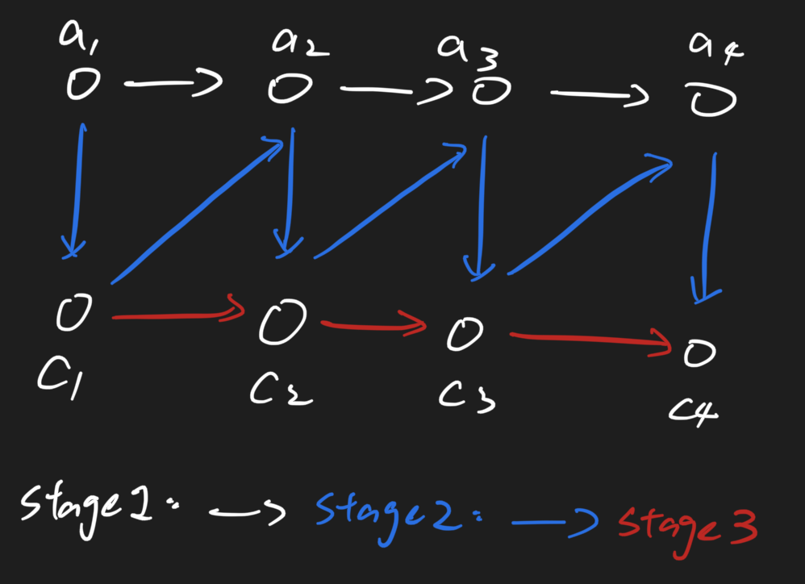

# Copy List with Random Pointer 105 \(M\)

## Problem

A linked list is given such that each node contains an additional random pointer which could point to any node in the list or null.  
Return a deep copy of the list.Challenge

Could you solve it with O\(1\) space?

## Solution 



### Code



```python
"""
Definition for singly-linked list with a random pointer.
class RandomListNode:
    def __init__(self, x):
        self.label = x
        self.next = None
        self.random = None
"""


class Solution:
    # @param head: A RandomListNode
    # @return: A RandomListNode
    def copyRandomList(self, head):
        # write your code here
        node = head
        while node:
            copy = RandomListNode(node.label)
            nxt = node.next
            node.next = copy
            copy.next = nxt
            node = nxt
        
        node = head
        head2 = node.next
        while node:
            copy = node.next
            nxt = copy.next
            if nxt:
                copy.next = nxt.next
            if node.random:
                copy.random = node.random.next
            node = nxt
        return head2
```



```

```



### Complexity Analysis

* **Time Complexity:**
* **Space Complexity:**

