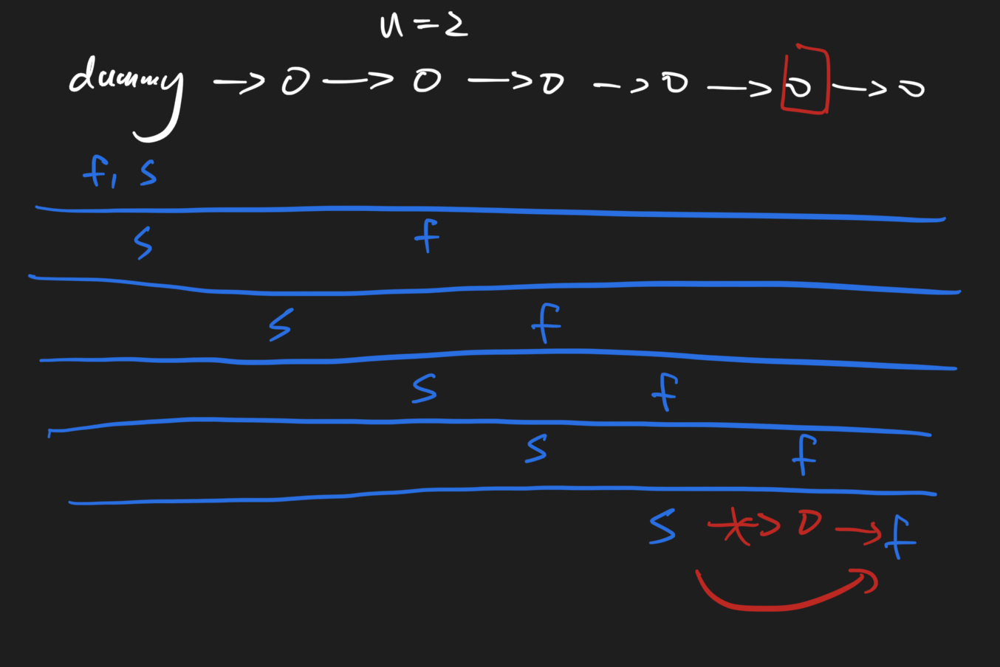

# Remove Nth Node From End of List 174 \(E\)

## Problem

Given a linked list, remove the nth node from the end of list and return its head.

The minimum number of nodes in list is _n_.Example

```text
Example 1:
	Input: list = 1->2->3->4->5->null， n = 2
	Output: 1->2->3->5->null


Example 2:
	Input:  list = 5->4->3->2->1->null, n = 2
	Output: 5->4->3->1->null

```

Challenge

Can you do it without getting the length of the linked list?

## Solution - Calculate from length

### Code



```python
"""
Definition of ListNode
class ListNode(object):
    def __init__(self, val, next=None):
        self.val = val
        self.next = next
"""

class Solution:
    """
    @param head: The first node of linked list.
    @param n: An integer
    @return: The head of linked list.
    """
    def removeNthFromEnd(self, head, n):
        # write your code here
        if head == None:
            return None
        
        dummy = ListNode(None, head)
        
        #ahead
        ahead = dummy
        for _ in range(n + 1):
            ahead = ahead.next
        
        #target
        tar_pre = dummy
        while ahead:
            ahead = ahead.next
            tar_pre = tar_pre.next
        
        tar_pre.next = tar_pre.next.next
        
        return dummy.next
```



```java
/**
 * Definition for ListNode
 * public class ListNode {
 *     int val;
 *     ListNode next;
 *     ListNode(int x) {
 *         val = x;
 *         next = null;
 *     }
 * }
 */

public class Solution {
    /**
     * @param head: The first node of linked list.
     * @param n: An integer
     * @return: The head of linked list.
     */
    public ListNode removeNthFromEnd(ListNode head, int n) {
        // write your code here
        if ( head == null) return null;
        
        ListNode dummy = new ListNode(0);
        dummy.next = head;
        ListNode ahead = dummy;
        
        for ( int i = 0 ; i < n + 1 ; i ++ ) {
            ahead = ahead.next;
        }
        
        ListNode tar_pre = dummy;
        while(ahead != null) {
            ahead = ahead.next;
            tar_pre = tar_pre.next;
        }
        
        tar_pre.next = tar_pre.next.next;
        return dummy.next;
    }
}
```



### Complexity Analysis

* **Time Complexity:**
* **Space Complexity:**

\*\*\*\*

## Solution - Slow Fast Pointer

Fast pointer go first for n steps, then both slow/fast pointers move. Once fast.next reach Null, then remove slow.next



### Code



```python
"""
Definition of ListNode
class ListNode(object):
    def __init__(self, val, next=None):
        self.val = val
        self.next = next
"""

class Solution:
    """
    @param head: The first node of linked list.
    @param n: An integer
    @return: The head of linked list.
    """
    def removeNthFromEnd(self, head, n):
        # write your code here
        dummy = ListNode(0)
        dummy.next = head 
        fast, slow = dummy, dummy

        while fast.next != None:
            if n <= 0:
                slow = slow.next
            fast = fast.next
            n-=1
        
        if slow.next:
            slow.next = slow.next.next
        return dummy.next
```



```

```



### Complexity Analysis

* **Time Complexity:**
* **Space Complexity:**

