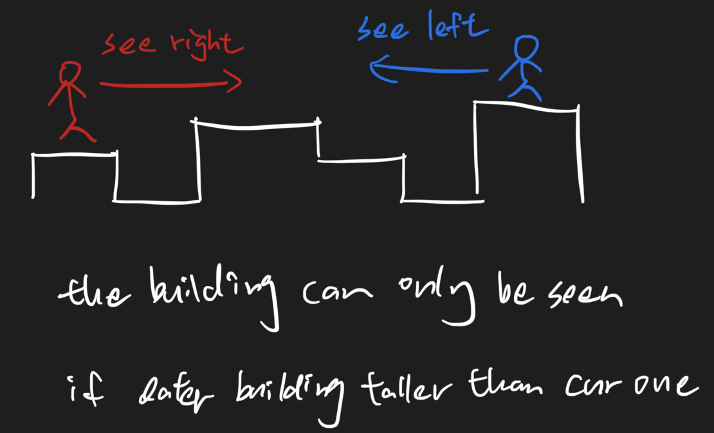

# Tall Building

## Problem

At the weekend, Xiao Q and his friends came to the big city for shopping. There are many tall buildings.There are `n` tall buildings in a row, whose height is indicated by `arr`.  
Xiao Q has walked from the first building to the last one. Xiao Q has never seen so many buildings, so he wants to know how many buildings can he see at the location of each building? \(When the height of the front building is greater than or equal to the back building, the back building will be blocked\)

1 \leq n \leq 1000001≤n≤100000  
1 \leq arr\[i\] \leq 1000001≤arr\[i\]≤100000Example

Example 1:

```text
Input:[5,3,8,3,2,5]Output:[3,3,5,4,4,4]Explanation:When Xiao Q is at position 0, he can see 3 tall buildings at positions 0, 1, and 2.When Xiao Q is at position 1, he can see  3 tall buildings at positions 0, 1, and 2.When Xiao Q is at position 2, he can see the building at position 0, 1 forward, and the building at position 3, 5 backward, plus the third building, a total of 5 buildings can be seen.When Xiao Q is at position 3, he can see 4 tall buildings in positions 2, 3, 4, and 5.When Xiao Q is at position 4, he can see 4 tall buildings in positions 2, 3, 4, and 5.When Xiao Q is at position 5, he can see 4 tall buildings in positions 2, 3, 4, and 5.
```

## Solution - Brute Force

### Code



```python
class Solution:
    """
    @param arr: the height of all buildings
    @return: how many buildings can he see at the location of each building
    """
    def tallBuilding(self, arr):
        # Write your code here.
        
        # cur build must can be seen
        res = [1] * len(arr)
        for i in range(len(arr)):
            # see right
            self.count_buildings(arr, res, i, range(i+ 1, len(arr)))
            # see left
            self.count_buildings(arr, res, i, range(i - 1, -1, -1))
        return res
    
    def count_buildings(self, arr, res, cur, id_list):
        highest, can_be_seen = float('-inf'), 0
        for i in id_list:
            if arr[i] > highest:
                highest = arr[i]
                can_be_seen+=1
        res[cur]+=can_be_seen
```



### Complexity Analysis

* **Time Complexity: O\(n^2\)**
* **Space Complexity: O\(n\)**

## Solution - Monotoic Stack



### Code



```python
class Solution:
    """
    @param arr: the height of all buildings
    @return: how many buildings can he see at the location of each building
    """
    def tallBuilding(self, arr):
        # Write your code here.
        
        # cur build must can be seen
        res = [1] * len(arr)
        # see left
        self.count_buildings(arr, res, range(0, len(arr)))
        # see right
        self.count_buildings(arr, res, range(len(arr) - 1, -1, -1))
        print(res)
        return res
    
    def count_buildings(self, arr, res, id_list):
        # should be descending
        stack = []
        can_be_seen = 0
        for i in id_list:
            res[i]+=can_be_seen
            can_be_seen+=1
            # when the later building is taller or equal to cur building, then it can block cur
            while stack and arr[stack[-1]] <= arr[i]:
                stack.pop()
                can_be_seen-=1
            stack.append(i)
```



### Complexity Analysis

* **Time Complexity: O\(n\)**
* **Space Complexity: O\(n\)**

