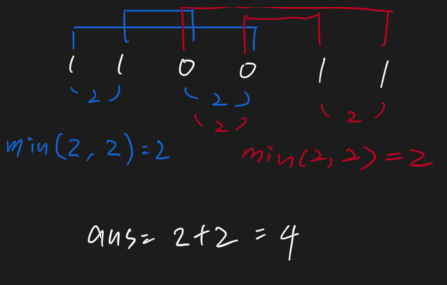

# Count Binary Substrings 1079 \(E\)

## Problem

* `1 <= s.length <= 105`
* `s[i]` is either `'0'` or `'1'`.

**Constraints:**

```text
Input: s = "10101"
Output: 4
Explanation: There are 4 substrings: "10", "01", "10", "01" that have equal number of consecutive 1's and 0's.
```

**Example 2:**

```text
Input: s = "00110011"
Output: 6
Explanation: There are 6 substrings that have equal number of consecutive 1's and 0's: "0011", "01", "1100", "10", "0011", and "01".
Notice that some of these substrings repeat and are counted the number of times they occur.
Also, "00110011" is not a valid substring because all the 0's (and 1's) are not grouped together.
```

**Example 1:**

Substrings that occur multiple times are counted the number of times they occur.

Give a binary string `s`, return the number of non-empty substrings that have the same number of `0`'s and `1`'s, and all the `0`'s and all the `1`'s in these substrings are grouped consecutively.

## Solution 



```python
class Solution:
    def kWeakestRows(self, mat: List[List[int]], k: int) -> List[int]:
        cnt = []
        for i in range(len(mat)):
            cnt_s = 0
            for element in mat[i]:
                if element == 1:
                    cnt_s+=1
            cnt.append((i, cnt_s))
        
        cnt.sort(key = lambda c:(c[1], c[0]))
        res = []
        for i in range(k):
            res.append(cnt[i][0])
        return res
```



### Complexity Analysis

* **Time Complexity: O\(m \* n\)**
* **Space Complexity: O\(n\)**

\*\*\*\*

## Solution - group by characters



```python
class Solution:
    def countBinarySubstrings(self, s: str) -> int:
        cnt = 1
        appears = []
        res = 0
        for i in range(1, len(s)):
            if s[i - 1] == s[i]:
                cnt+=1
            else:
                appears.append(cnt)
                cnt = 1
        appears.append(cnt)
        for i in range(len(appears) - 1):
            res+=(min(appears[i], appears[i + 1]))
        return res       
```



### Complexity Analysis

* **Time Complexity: O\(n\)**
* **Space Complexity: O\(n\)**

## Solution - O\(1\) Space





```python
class Solution:
    def countBinarySubstrings(self, s: str) -> int:
        prev_cnt = 0
        
        ans = 0
        i = 0
        while i < len(s):
            cur_cnt = 1
            while i < len(s) - 1 and s[i] == s[i + 1]:
                i+=1
                cur_cnt+=1
            
            if prev_cnt > 0:
                ans+=min(prev_cnt, cur_cnt)
            prev_cnt = cur_cnt
            i+=1
        return ans
```



### Complexity Analysis

* **Time Complexity: O\(n\)**
* **Space Complexity: O\(1\)**

\*\*\*\*

\*\*\*\*

