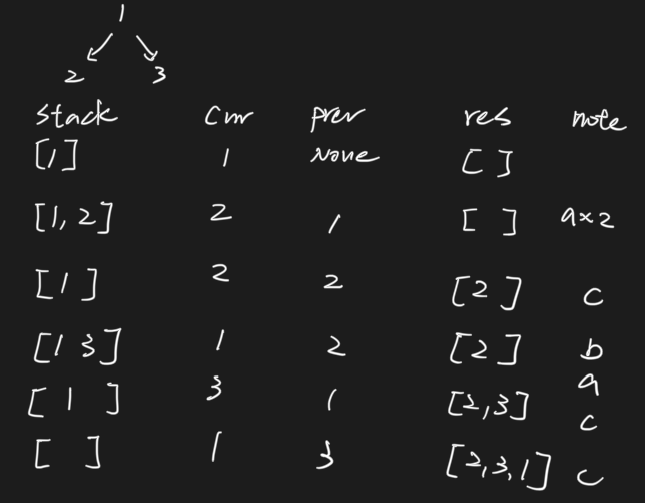
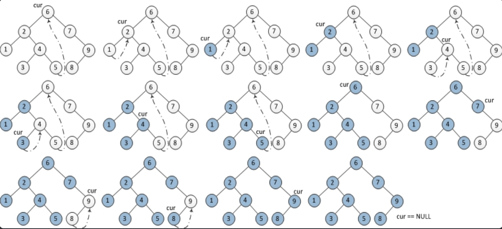
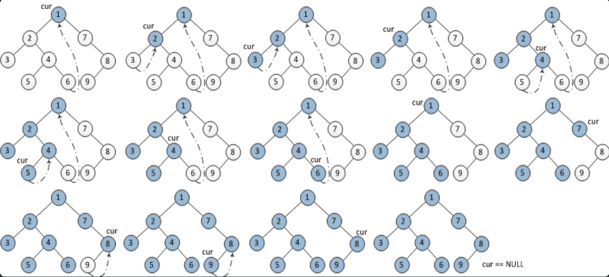

# Binary Tree

## Post-Order Traversal \(Non-recursion\)





```python
class Solution:
    """
    @param root: A Tree
    @return: Postorder in ArrayList which contains node values.
    """
    def postorderTraversal(self, root):
        result = []
        stack = []
        prev, curr = None, root

        if not root:
            return result

        stack.append(root)
        while len(stack) > 0:
            curr = stack[-1]
            if not prev or prev.left == curr or prev.right == curr:  # traverse down the tree
                if curr.left:
                    stack.append(curr.left)
                elif curr.right:
                    stack.append(curr.right)
            elif curr.left == prev:  # traverse up the tree from the left
                if curr.right:
                    stack.append(curr.right)
            else:  # traverse up the tree from the right
                result.append(curr.val)
                stack.pop()
            prev = curr

        return result
```



## Morris Algorithm

### In-Order Traversal



1. 如果当前节点的左孩子为空，则输出当前节点并将其右孩子作为当前节点。
2. 如果当前节点的左孩子不为空，在当前节点的左子树中找到当前节点在中序遍历下的前驱节点。
   1. 如果前驱节点的右孩子为空，将它的右孩子设置为当前节点。当前节点更新为当前节点的左孩子。
   2. 如果前驱节点的右孩子为当前节点，将它的右孩子重新设为空（恢复树的形状）。输出当前节点。当前节点更新为当前节点的右孩子。
3. 重复1、2两步直到当前节点为空。



```python
class Solution:
    """
    @param root: A Tree
    @return: Inorder in ArrayList which contains node values.
    """
    def inorderTraversal(self, root):
        nums = []
        cur = None
    
        while root:
            if root.left:
                cur = root.left
                while cur.right and cur.right != root:
                    cur = cur.right
                
                if cur.right == root:
                    nums.append(root.val)
                    cur.right = None
                    root = root.right
                else:
                    cur.right = root
                    root = root.left
            else:
                nums.append(root.val)
                root = root.right
                
        return nums
```



```java
public class Solution {
    /**
     * @param root: A Tree
     * @return: Inorder in ArrayList which contains node values.
     */

    public List<Integer> inorderTraversal(TreeNode root) {
        List<Integer> nums = new ArrayList<>();
        TreeNode cur = null;

        while (root != null) {
            if (root.left != null) {
                cur = root.left;
                while (cur.right != null && cur.right != root) {
                    cur = cur.right;
                }

                if (cur.right == root) {
                    nums.add(root.val);
                    cur.right = null;
                    root = root.right;
                } else {
                    cur.right = root;
                    root = root.left;
                }               
            } else {
                nums.add(root.val);
                root = root.right;
            }
        }

        return nums;
    } 

}

```



### Pre-Order Traversal



1. 如果当前节点的左孩子为空，则输出当前节点并将其右孩子作为当前节点。
2. 如果当前节点的左孩子不为空，在当前节点的左子树中找到当前节点在中序遍历下的前驱节点。
   1. 如果前驱节点的右孩子为空，将它的右孩子设置为当前节点。**输出当前节点**（与中序遍历唯一一点不同）。当前节点更新为当前节点的左孩子。
   2. 如果前驱节点的右孩子为当前节点，将它的右孩子重新设为空。当前节点更新为当前节点的右孩子。
3. 重复1、2两步直到当前节点为空。



```python
class Solution:
    """
    @param root: A Tree
    @return: Preorder in ArrayList which contains node values.
    """
    def preorderTraversal(self, root):
        nums = []
        cur = None
        
        while root:
            if root.left:
                cur = root.left
                while cur.right and cur.right != root:
                    cur = cur.right
                if cur.right == root:
                    cur.right = None
                    root = root.right
                else:
                    nums.append(root.val)
                    cur.right = root
                    root = root.left
            else:
                nums.append(root.val)
                root = root.right
                
        return nums
```



```java
public class Solution {
    /**
     * @param root: A Tree
     * @return: Preorder in ArrayList which contains node values.
     */
    public List<Integer> preorderTraversal(TreeNode root) {
        // morris traversal
        List<Integer> nums = new ArrayList<>();
        TreeNode cur = null;
        while (root != null) {
            if (root.left != null) {
                cur = root.left;
                // find the predecessor of root node
                while (cur.right != null && cur.right != root) {
                    cur = cur.right;
                }
                if (cur.right == root) {
                    cur.right = null;
                    root = root.right;
                } else {
                    nums.add(root.val);
                    cur.right = root;
                    root = root.left;
                }
            } else {
                nums.add(root.val);   
                root = root.right;
            }
        }
        return nums;
    } 
}
```



### Post-Order Traversal



```python
class Solution:
    """
    @param root: A Tree
    @return: Postorder in ArrayList which contains node values.
    """
    def postorderTraversal(self, root):
        nums = []
        cur = None

        while root:
            if root.right != None:
                cur = root.right
                while cur.left and cur.left != root:
                    cur = cur.left
                if cur.left == root:
                    cur.left = None
                    root = root.left
                else:
                    nums.append(root.val)
                    cur.left = root
                    root = root.right
            else:
                nums.append(root.val)
                root = root.left
                
        nums.reverse()
        return nums
```



```java
public class Solution {
    /**
     * @param root: A Tree
     * @return: Postorder in ArrayList which contains node values.
     */
    public List<Integer> postorderTraversal(TreeNode root) {
        List<Integer> nums = new ArrayList<>();
        TreeNode cur = null;
        while (root != null) {
            if (root.right != null) {
                cur = root.right;
                while (cur.left != null && cur.left != root) {
                    cur = cur.left;
                }
                if (cur.left == root) {
                    cur.left = null;
                    root = root.left;
                } else {
                    nums.add(root.val);
                    cur.left = root;
                    root = root.right;
                }
            } else {
                nums.add(root.val);
                root = root.left;
            }
        }
        Collections.reverse(nums);
        return nums;
    } 
}
```



## Find Descendatns \(including itself\) of balanced complete tree

```python
import collections
n = 7 # total balanced tree nodes number

descendants = {}
for i in range(n):
    descendant_list = []
    queue = collections.deque()
    queue.append(i)
    idx = i
    while queue:
        node = queue.popleft()
        if node != i:
            descendant_list.append(node)
        if node * 2 + 2 <= 7:
            queue.append(node* 2 + 1)
            queue.append(node * 2 + 2)
    descendants[i] = sorted(list(descendant_list))
print(descendants)
```

```text
{0: [1, 2, 3, 4, 5, 6], 1: [3, 4], 2: [5, 6], 3: [], 4: [], 5: [], 6: []}
```

