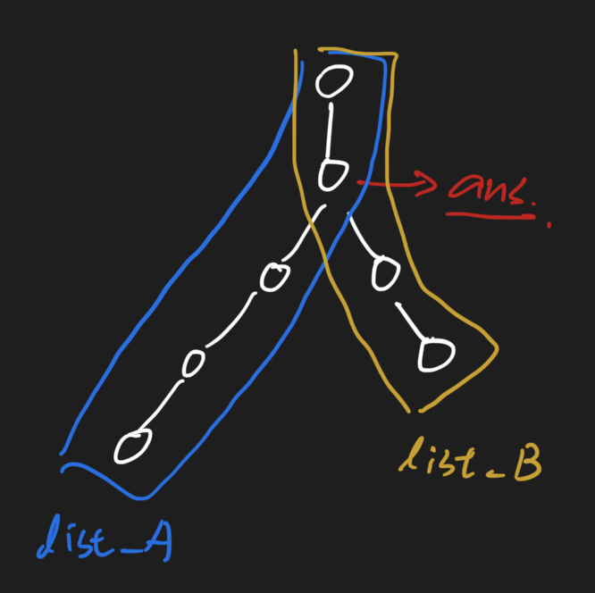

# Lowest Common Ancestor II 474 \(E\)

## Problem

Description

Given the root and two nodes in a Binary Tree. Find the lowest common ancestor\(LCA\) of the two nodes.

The nearest common ancestor of two nodes refers to the nearest common node among all the parent nodes of two nodes \(including the two nodes\).

In addition to the left and right son pointers, each node also contains a father pointer, `parent`, pointing to its own father.Example

**Example 1:**

```text
Input：{4,3,7,#,#,5,6},3,5
Output：4
Explanation：
     4
     / \
    3   7
       / \
      5   6
LCA(3, 5) = 4
```

**Example 2:**

```text
Input：{4,3,7,#,#,5,6},5,6
Output：7
Explanation：
      4
     / \
    3   7
       / \
      5   6
LCA(5, 6) = 7
```

## Solution - List

### Code



```python

```



```

```



### Complexity Analysis

* **Time Complexity:**
* **Space Complexity:**

\*\*\*\*

## Solution - HashSet

### Code



```python
"""
Definition of ParentTreeNode:
class ParentTreeNode:
    def __init__(self, val):
        self.val = val
        self.parent, self.left, self.right = None, None, None
"""


class Solution:
    """
    @param: root: The root of the tree
    @param: A: node in the tree
    @param: B: node in the tree
    @return: The lowest common ancestor of A and B
    """
    def lowestCommonAncestorII(self, root, A, B):
        # write your code 
        parent_set = set()
        
        curr = A
        while curr:
            parent_set.add(curr)
            curr = curr.parent
        
        curr = B
        while curr:
            if curr in parent_set:
                return curr
            curr = curr.parent
        return None
```



```

```



### Complexity Analysis

* **Time Complexity:**
* **Space Complexity:**

\*\*\*\*

## Solution - List

Use two lists to record all the values, than find the last same values from both



### Code



```python
"""
Definition of ParentTreeNode:
class ParentTreeNode:
    def __init__(self, val):
        self.val = val
        self.parent, self.left, self.right = None, None, None
"""


class Solution:
    """
    @param: root: The root of the tree
    @param: A: node in the tree
    @param: B: node in the tree
    @return: The lowest common ancestor of A and B
    """
    def lowestCommonAncestorII(self, root, A, B):
        # write your code 
        parent_set = set()
        
        curr = A
        while curr:
            parent_set.add(curr)
            curr = curr.parent
        
        curr = B
        while curr:
            if curr in parent_set:
                return curr
            curr = curr.parent
        return None
```



```

```



### Complexity Analysis

* **Time Complexity:**
* **Space Complexity:**

