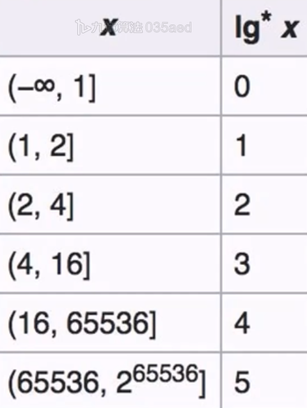
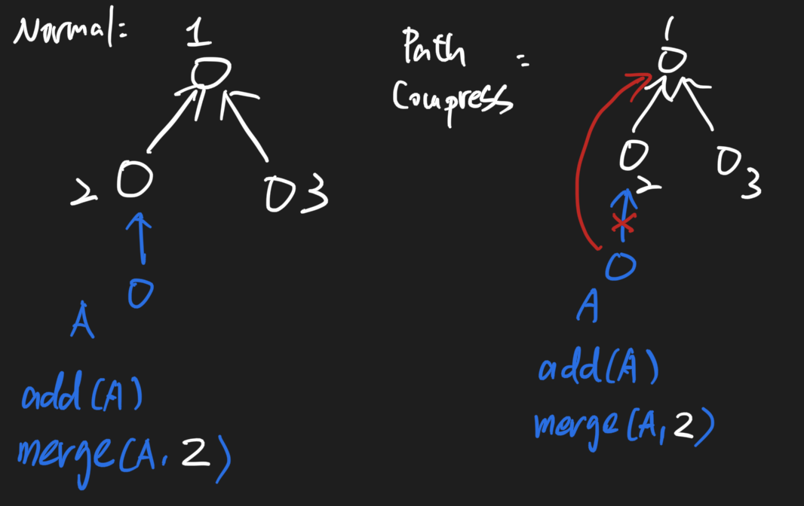

# Union Find

## What's Union / Find?

It's a data structure supports following features:

* O\(1\): Merge\(x, y\), merge x, y two sets
* O\(1\): Find\(x\), find the set that x belongs to
* O\(1\): isConnected\(x, y\), find whether x, y are in the same set or not
* O\(1\): get size of set

## Template:

Time Complexity:

* add\(\): O\(1\)
* find\(\): O\(n\), n as the worst case that x reach the root length \(as a list\)
* merge\(\): O\(n\)
* is\_connected\(\): O\(1\)

```python
class UnionFind:
    def __init__(self):
        # father pointer
        self.father = {}
        self.size_of_set = {}
        self.num_of_set = 0
    def add(self, x):
        # if node alreay exist
        if x in self.father:
            return 
        self.father[x] = None
        self.size_of_set[x] = 1
        self.num_of_set+=1
    def find(self, x):
        # root point to x
        # and recursively traverse back to find it's father 
        root = x
        while self.father[root]:
            root = self.father[root]
        return root
    def merge(self, x, y):
        root_x, root_y = self.find(x), self.find(y)
        
        # if they are not in the same component, let root_x point to root_y
        if root_x != root_y:
            self.father[x] = root_y
            self.num_of_set-=1
            self.size_of_set[root_y]+=self.size_of_set[root_x]
    # is_connected can check on following condition
    # 1. two nodes in same set?
    # 2. two nodes belongs to same component?
    # 3. two nodes are connected?
    def is_connected(self, x, y):
        return self.find(x) == self.find(y)
    def get_num_of_set(self):
        return self.num_of_set
    def get_size_of_set(self, node):
        return self.size_of_set[self.find(node)]
```

## Template with Path Compression

Time Complexity:

* add\(\): O\(1\)
* find\(\): O\(log\*n\) == O\(1\), only the first time has to traverse the whole list
* merge\(\): O\(n\)
* is\_connected\(\): O\(1\)








```python
class UnionFind:
    def __init__(self):
        # father pointer
        self.father = {}
    def add(self, x):
        # if node alreay exist
        if x in self.father:
            return 
        self.father[x] = None
        self.size_of_set[x] = 1
        self.num_of_set+=1
    def find(self, x):
        # root point to x
        # and recursively traverse back to find it's father 
        root = x
        while self.father[root]:
            root = self.father[root]
        # path compression
        # to let every nodes on the path (evetually point to root), directly point to root instead
        while x!= root:
            original_father = self.father[x]
            self.father[x] = root
            x = original_father

        return root
    def merge(self, x, y):
        root_x, root_y = self.find(x), self.find(y)
        
        # if they are not in the same component, let root_x point to root_y
        if root_x != root_y:
            self.father[x] = root_y
            self.num_of_set-=1
            self.size_of_set[root_y]+=self.size_of_set[root_x]
    # is_connected can check on following condition
    # 1. two nodes in same set?
    # 2. two nodes belongs to same component?
    # 3. two nodes are connected?
    
    def is_connected(self, x, y):
        return self.find(x) == self.find(y)
    def get_num_of_set(self):
        return self.num_of_set
    def get_size_of_set(self, node):
        return self.size_of_set[self.find(node)]
```




