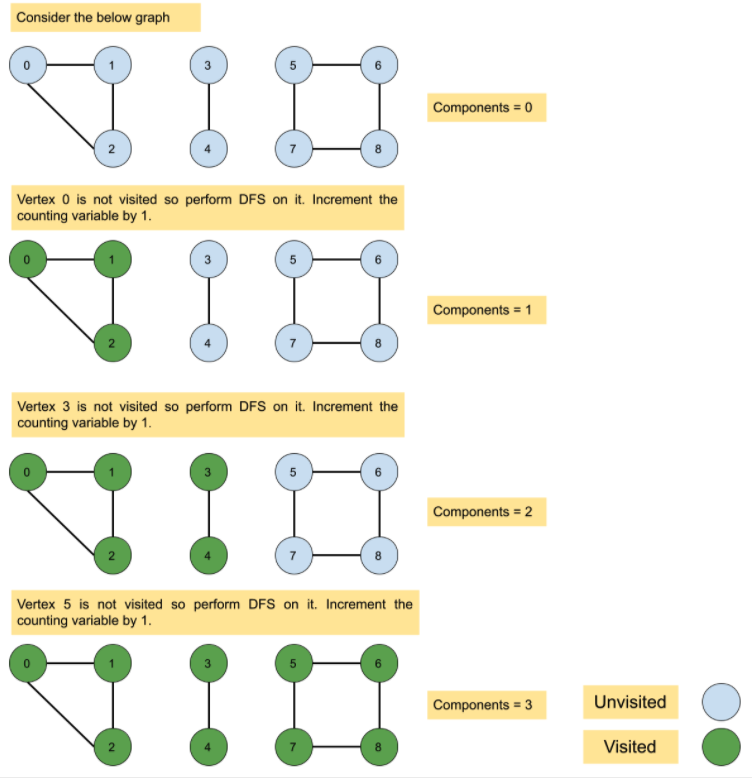

# Number of Connected Components in an Undirected Graph \(LeetCode323\) \(M\)

## Problem

You have a graph of `n` nodes. You are given an integer `n` and an array `edges` where `edges[i] = [ai, bi]` indicates that there is an edge between `ai` and `bi` in the graph.

Return _the number of connected components in the graph_.

**Example 1:**

```text
Input: n = 5, edges = [[0,1],[1,2],[3,4]]
Output: 2
```

**Example 2:**

```text
Input: n = 5, edges = [[0,1],[1,2],[2,3],[3,4]]
Output: 1
```

**Constraints:**

* `1 <= n <= 2000`
* `1 <= edges.length <= 5000`
* `edges[i].length == 2`
* `0 <= ai <= bi < n`
* `ai != bi`
* There are no repeated edges.

## Solution - DFS



### Code 



```python
class Solution:
    def countComponents(self, n: int, edges: List[List[int]]) -> int:
        cnt = 0
        visited = set()
        
        adj_list = [[] for _ in range(n)]
        
        # construct adjacent list 
        for i in range(len(edges)):
            adj_list[edges[i][0]].append(edges[i][1])
            adj_list[edges[i][1]].append(edges[i][0])
        
        for i in range(n):
            if not visited:
                cnt+=1
                self.dfs(adj_list, visited, i)
        return cnt
    
    def dfs(self, adj_list, visited, start):
        visited.add(start)
        for neighbor in adj_list[start]:
            if neighbor not in visited:
                self.dfs(adj_list, visited, neighbor)
    
```



### Complexity Analysis

* **Time Complexity: O\(N + E\)**
  * Graph: O\(n\)
  * Edges: O\(E\)
* **Space Complexity:**

\*\*\*\*

\*\*\*\*

## Solution 



```python
class Solution:
    def countComponents(self, n: int, edges: List[List[int]]) -> int:
        # construct adjacent list
        adj_list = [[] for _ in range(n)]
        for i in range(len(edges)):
            adj_list[edges[i][0]].append(edges[i][1])
            adj_list[edges[i][1]].append(edges[i][0])
        visited = set()
        cnt = 0
        queue = collections.deque()
        for i in range(n):
            if i not in visited:
                cnt+=1
                queue.append(i)
                visited.add(i)
                self.bfs(adj_list, visited, queue)
        return cnt
    
    def bfs(self, adj_list, visited, queue):
        while queue:
            start = queue.popleft()
            for neighbor in adj_list[start]:
                if neighbor not in visited:
                    queue.append(neighbor)
                    visited.add(neighbor)
```



### Complexity Analysis

* **Time Complexity:** 
* **Space Complexity:** 

## Solution - Union Find

First init an array of n, and each value stores that index's parent \(initially every parent is itself\), later traverse the edges, and union the edges pairs. Like \[0,1\], then set both\(0, 1 nodes\) of their parents to 1. Then do like this so on and so forth

### Code



```python
class Solution:
    def countComponents(self, n: int, edges: List[List[int]]) -> int:
        ids = []
        # initially, point all node to themselves
        for i in range(n): # O(n)
            ids.append(i)
        
        for edge in edges: #O(m)
            # merge the edges, and set to only one parent
            self.union(edge[0], edge[1], ids)
        sets = set()
        for i in range(n):
            # unique parents number
            sets.add(self.find(i, ids))
        return len(sets)
        
    def union(self, edge1, edge2, ids):
        parent1 = self.find(edge1, ids)
        parent2 = self.find(edge2, ids)
        ids[parent1] = parent2
        
    
    def find(self, edge, ids): # O(logn)
        if ids[edge] != edge:
            # path compression
            ids[edge] = self.find(ids[edge], ids)
        return ids[edge]
```



### Complexity Analysis

* **Time Complexity: O\(n + m \* logn\)**
  * n: total nodes
  * m: edges amount
* **Space Complexity: O\(n\)**

