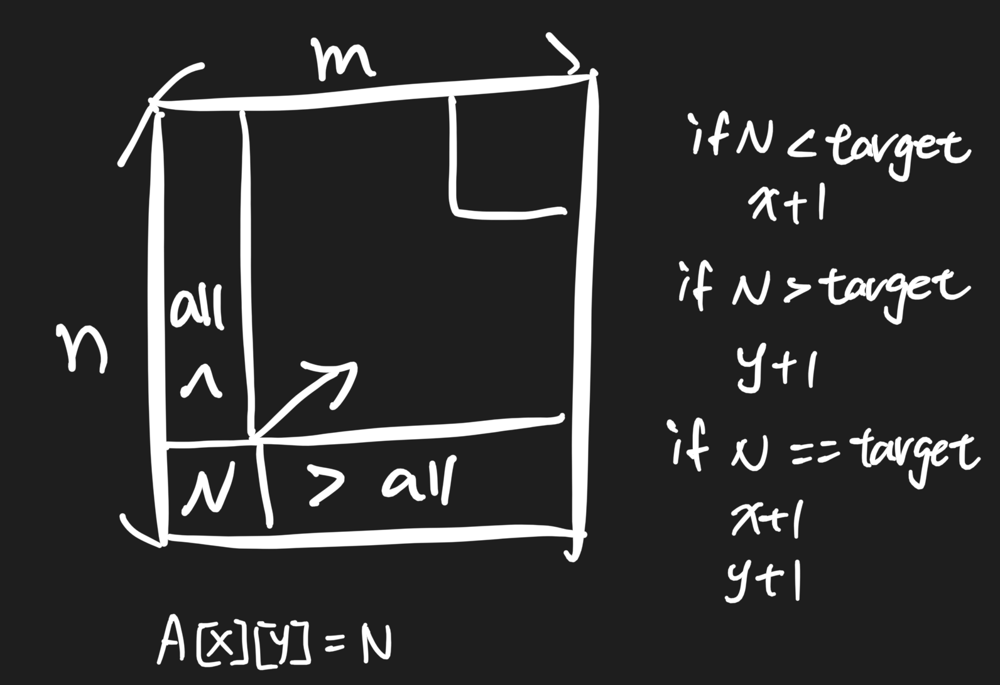
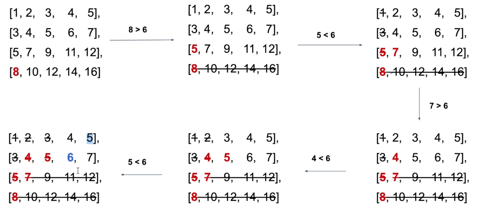

# Search a 2D Matrix II 38 \(M\)

## Problem

Write an efficient algorithm that searches for a value in an m x n matrix, return The number of occurrence of it.

This matrix has the following properties:

* Integers in each row are sorted from left to right.
* Integers in each column are sorted from up to bottom.
* No duplicate integers in each row or column.

Example

Example 1:

```text
Input:
	[[3,4]]
	target=3
Output:1
```

Example 2:

```text
Input:
    [
      [1, 3, 5, 7],
      [2, 4, 7, 8],
      [3, 5, 9, 10]
    ]
    target = 3
Output:2
```

Challenge

O\(m+n\) time and O\(1\) extra space

## Approach 

### Intuition 





### Code



```python
class Solution:
    """
    @param matrix: A list of lists of integers
    @param target: An integer you want to search in matrix
    @return: An integer indicate the total occurrence of target in the given matrix
    """
    def searchMatrix(self, matrix, target):
        # write your code here
        res = 0
        if not matrix:
            return res
        
        n, m = len(matrix), len(matrix[0])
        print(n, m)
        y, x = n - 1, 0
        print(y, x)
        while x <= m - 1 and y >= 0:
            if matrix[y][x] > target:
                y-=1
            elif matrix[y][x] < target:
                x+=1
            else:
                res+=1
                x+=1
                y-=1
        return res
```



```

```



### Complexity Analysis

* **Time Complexity:**
* **Space Complexity:**

