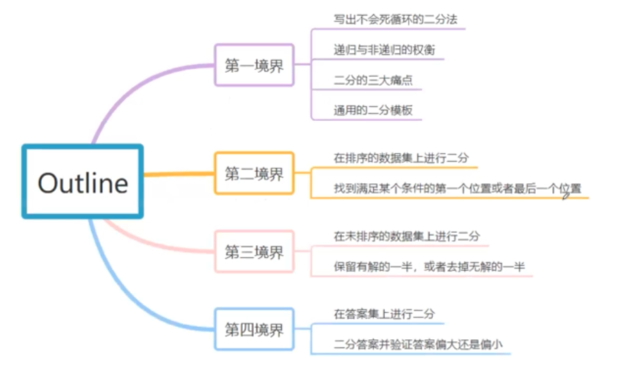

# Binary Search

## Binary Selection 

Arguably one of the most frequent interview question

### Application

To find certain number in a sorted array, its time complexity is O\(logn\), better than regular O\(n\)



### Template



```python
class Solution:
    # @param nums: The integer array
    # @param target: Target number to find
    # @return the first position of target in nums, position start from 0 
    def binarySearch(self, nums, target):
        if not nums:
            return -1

        start, end = 0, len(nums) - 1
        # Use "start + 1" < end and not "start < end" to avoid deadlock 
        # In first position of target no dead lock
        # But in last position of target would have dead lock
        # Ex：nums=[1，1] target = 1
        # To unify template: start + 1 < end，guarantee no deadlock 
        while start + 1 < end:
            # python no overflow problem, can write like this
            # java/C++ better write as mid = start + (end - start) / 2
            # to avoid when start = 2^31 - 1, end = 2^31 - 1, overflow happened
            mid = (start + end) // 2
         
            # can write as start = mid + 1
            # however, in some case finding target interval, this may lost some value
            # writing as start = mid won't affect algorithm correctness
            # still O(logn) (like logn vs log(n+1), both is Ologn)
            if nums[mid] < target:
                start = mid
            # WARNING!
            # In first position, should be "end = mid", since we care if there any target before mid
            # In last position, should be "start = mid", since we care if there any target after mid
            # template here show for first position case
            elif nums[mid] == target:
                end = mid
            else: # nums[mid] > target
                end = mid

        # search again in start/end
        # since above while loop end when reaching two element left (start + end)
        # these two still need check up 
        if nums[start] == target:
            return start
        if nums[end] == target:
            return end

        return -1
```




