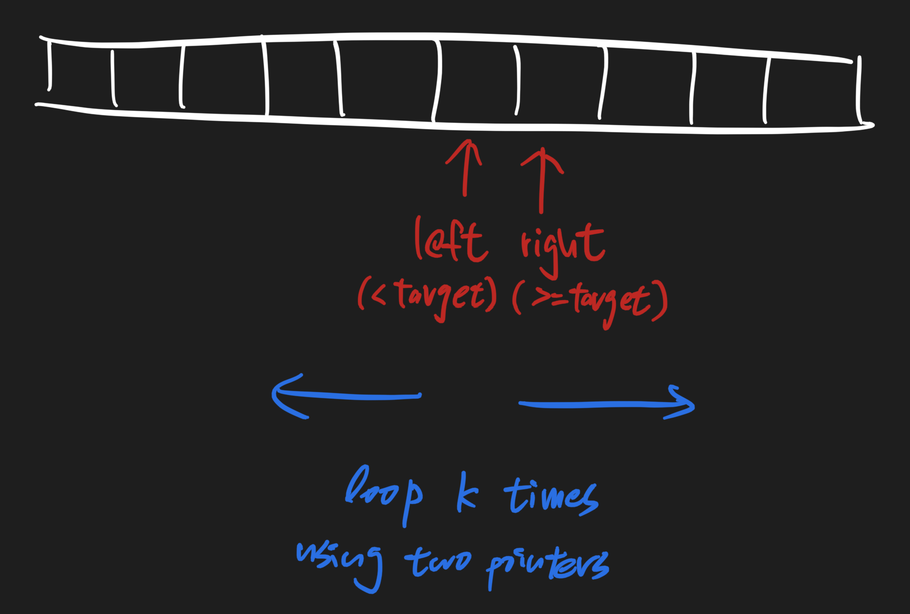

# Find K Closest Elements 460 \(M\)

## Problem

Description

Given `target`, a non-negative integer `k` and an integer array `A` sorted in ascending order, find the `k` closest numbers to `target` in `A`, sorted in ascending order by the difference between the number and target. Otherwise, sorted in ascending order by number if the difference is same.

1. The value `k` is a non-negative integer and will always be smaller than the length of the sorted array.
2. Length of the given array is positive and will not exceed 10^410​4​​
3. Absolute value of elements in the array will not exceed 10^410​4​​

Example

**Example 1:**

```text
Input: A = [1, 2, 3], target = 2, k = 3
Output: [2, 1, 3]
```

**Example 2:**

```text
Input: A = [1, 4, 6, 8], target = 3, k = 3
Output: [4, 1, 6]
```

Challenge

O\(logn + k\) time

## Solution



### Code



```python
class Solution:
    """
    @param A: an integer array
    @param target: An integer
    @param k: An integer
    @return: an integer array
    """
    def kClosestNumbers(self, A, target, k):
        # write your code here
        # find the A[left] that's biggest < target
        # find the A[right] that's smallest >= target

        right = self.find_upper_closest(A, target)
        left = right - 1
        print(left, right)

        res = []
        for _ in range(k):
            if self.is_left_closer(A, target, left, right):
                res.append(A[left])
                left-=1
            else:
                res.append(A[right])
                right+=1
        return res
    
    def find_upper_closest(self, A, target):
        start, end = 0, len(A) - 1
        while start + 1 < end:
            mid = (start + end) // 2
            if A[mid] < target:
                start = mid
            else:
                end = mid
        # WARNING!
        # should find ">=" instead of "=="
        # because start would be closer to target
        if A[start] >= target:
            return start
        # WARNING!
        # should find ">=" instead of "=="
        if A[end] >= target:
            return end
        # if cannot find, return length
        return len(A)
    
    def is_left_closer(self, A, target, left, right):
        if left < 0:
            return False
        # if right out of bound, then left values are always valid
        if right >= len(A):
            return True
        return target - A[left] <= A[right] - target


```



```

```



### Complexity Analysis

* **Time Complexity: O\(nlogn\)**
  * Binary Search: O\(nlogn\)
  * Two Pointer: O\(k\)
    * k &lt;= n
* **Space Complexity: O\(1\)**

