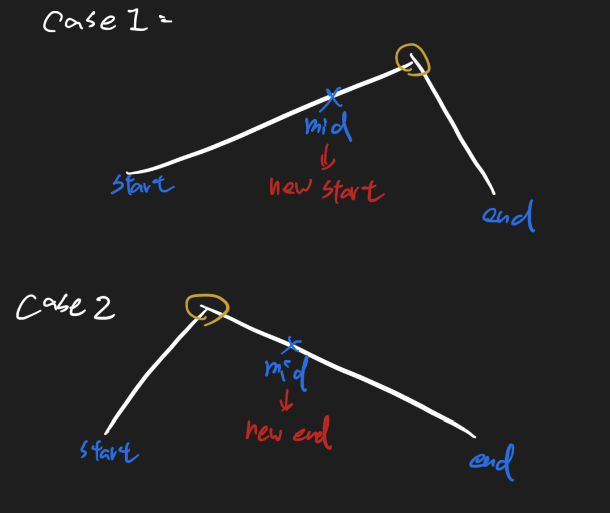

# Maximum Number in Mountain Sequence 585 \(M\)

## Problem

Given a mountain sequence of `n` integers which increase firstly and then decrease, find the mountain top\(Maximum\).

Arrays are strictly incremented, strictly decreasing

Example 1:

```text
Input: nums = [1, 2, 4, 8, 6, 3] 
Output: 8
```

Example 2:

```text
Input: nums = [10, 9, 8, 7], 
Output: 10
```

## Solution

Using for loop is too slow O\(n\), using binary search for answer



### Code



```python
class Solution:
    """
    @param nums: a mountain sequence which increase firstly and then decrease
    @return: then mountain top
    """
    def mountainSequence(self, nums):
        # write your code here
        if not nums:
            return -1
        
        start, end = 0, len(nums) - 1
        while start + 1 < end:
            mid = (start + end) // 2

            if nums[mid] > nums[mid + 1]:
                end = mid
            else:
                start = mid
        return max(nums[start], nums[end])


```



```

```



### Complexity Analysis

* **Time Complexity: O\(logn\)**
* **Space Complexity: O\(1\)**

