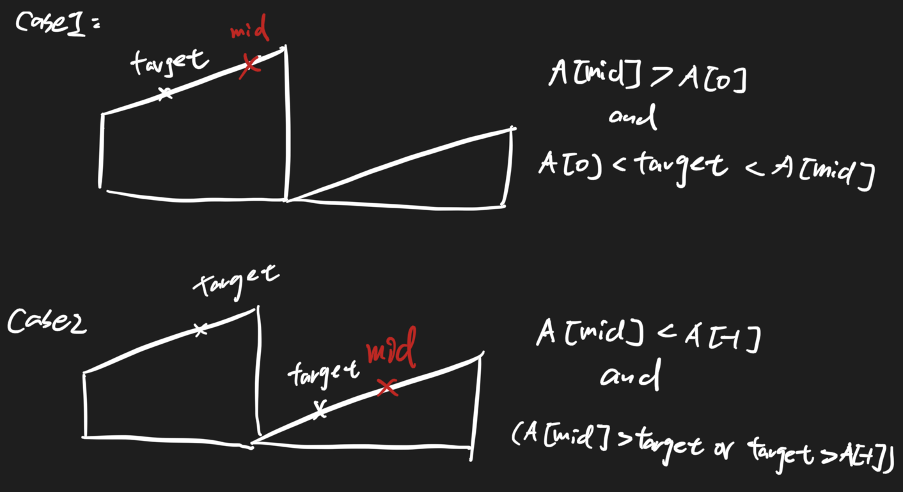

# Search in Rotated Sorted Array 62 \(M\)

## Problem

Description

Suppose a sorted array is rotated at some pivot unknown to you beforehand.

\(i.e., `0 1 2 4 5 6 7` might become `4 5 6 7 0 1 2`\).

You are given a target value to search. If found in the array return its index, otherwise return -1.

You may assume no duplicate exists in the array.Example

Example 1:

```text
Input: [4, 5, 1, 2, 3] and target=1, 
Output: 2.
```

Example 2:

```text
Input: [4, 5, 1, 2, 3] and target=0, 
Output: -1.
```

Challenge

O\(logN\) time

## Solution - Two Time Binary Search


### Code



```python
class Solution:
    """
    @param A: an integer rotated sorted array
    @param target: an integer to be searched
    @return: an integer
    """
    def search(self, A, target):
        # write your code here
        if not A:
            return -1
        # first find the minimum value index
        index = self.find_min_index(A)
        print(index)
        # then dicide to do the search on either left/right parts
        if A[index] <= target <= A[-1]:
            return self.binary_search(A, index, len(A) - 1, target)
        return self.binary_search(A, 0, index - 1, target)
    
    def find_min_index(self, A):
        start, end = 0, len(A) - 1
        mid = (start + end)//2
        
        while start + 1 < end:
            if A[mid] > A[0] and A[mid] > A[-1]:
                start = mid
            else:
                end = mid
        if A[start] < A[end]:
            return start
        return end
    
    def binary_search(self, A, start, end, target):
        # if len(A) == 1
        if end < 0:
            end+=len(A)
        while start + 1 < end:
            mid = (start + end)//2
            if A[mid] < target:
                start = mid
            else:
                end = mid
        if A[start] == target:
            return start
        if A[end] == target:
            return end
        return -1
```



```

```



### Complexity Analysis

* **Time Complexity:**
* **Space Complexity:**

\*\*\*\*

## Solution - One Time Binary Search

To judge whether target is on the mid's left side or not?



### Code



```python
class Solution:
    """
    @param A: an integer rotated sorted array
    @param target: an integer to be searched
    @return: an integer
    """
    def search(self, A, target):
        # write your code here
        if not A:
            return -1
        start, end = 0, len(A) - 1
        while start + 1 < end:
            mid = (start + end)//2
            if self.target_is_left(A, mid, target):
                end = mid
            else:
                start = mid
        if A[start] == target:
            return start
        if A[end] == target:
            return end
        return -1
    
    def target_is_left(self, A, mid, target):
        if A[mid] > A[0] and A[0] < target < A[mid]:
            return True
        if A[mid] < A[-1] and (A[mid] > target or target > A[-1]):
            return True
        return False      
```



```

```



### Complexity Analysis

* **Time Complexity:**
* **Space Complexity:**

