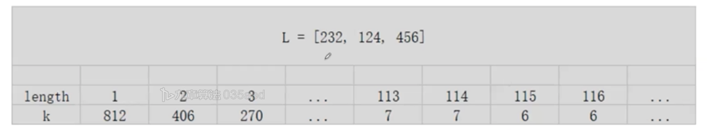

# Wood Cut 183 \(H\)

## Problem

Given n pieces of wood with length `L[i]` \(integer array\). Cut them into small pieces to guarantee you could have equal or more than k pieces with the same length. What is the longest length you can get from the n pieces of wood? Given L & k, return the maximum length of the small pieces.

The unit of length is centimeter.The length of the woods are all positive integers,you couldn't cut wood into float length.If you couldn't get &gt;= _k_ pieces, return `0`.Example

**Example 1**

```text
Input:
L = [232, 124, 456]
k = 7
Output: 114
Explanation: We can cut it into 7 pieces if any piece is 114cm long, however we can't cut it into 7 pieces if any piece is 115cm long.
```

**Example 2**

```text
Input:
L = [1, 2, 3]
k = 7
Output: 0
Explanation: It is obvious we can't make it.
```

Challenge

O\(n log Len\), where Len is the longest length of the wood.

## Solution



### Code



```python
class Solution:
    """
    @param L: Given n pieces of wood with length L[i]
    @param k: An integer
    @return: The maximum length of the small pieces
    """
    def woodCut(self, L, k):
        # write your code here
        if not L or k == 0:
            return 0
        # end can simply write max(L), but the following condition is more strict
        start, end = 1, min(max(L), sum(L)//k)
        # if even sum(L) divided by L < 1, then defintly can't have solution here
        if start > end:
            return 0

        while start + 1 < end:
            mid = (start + end)//2
            if self.get_pieces(L, mid) < k:
                end = mid
            else:
                start = mid
        if self.get_pieces(L, end) >= k:
            return end
        if self.get_pieces(L, start) >= k:
            return start
        
        return 0
    
    # O(n)
    def get_pieces(self, L, length):
        return sum(l//length for l in L)
            
```



```

```



### Complexity Analysis

* **Time Complexity:**
* **Space Complexity:**

