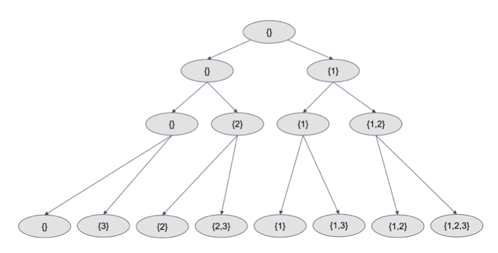
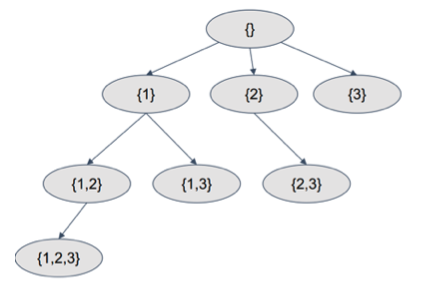

# 17. Subsets \(M\)

## Problem

[https://www.lintcode.com/problem/17/](https://www.lintcode.com/problem/17/)

### Description

Given a set of distinct integers, return all possible subsets.


* Elements in a subset must be in _non-descending_ order.
* The solution set must not contain duplicate subsets.


### Example

**Example 1:**

```text
Input: [0]
Output:
[
  [],
  [0]
]
```

**Example 2:**

```text
Input: [1,2,3]
Output:
[
  [3],
  [1],
  [2],
  [1,2,3],
  [1,3],
  [2,3],
  [1,2],
  []
]
```

## Approach - DFS Recursion

### Intuition

For every element in array can have two status: selected or not selected 

```text
Array: [1, 2, 3]

Selected: 0 / Not selected: 1
[0, 1, 0] => [2]
[1, 1, 0] => [1, 2]
```



### Algorithm 

Recursion the array, and started from index 0, then for each index, can be selected or not selected, then store answers back to result

#### Step by step

* Init array `res` \(2D\), `subset`\(1D\)
* Sort the array `nums`
* Start from index 0, and recursively process be selecting `nums[index]` and not selecting `nums[index]` 
  * First process "if selected", add `nums[index]` into `subset`
  * Then process "not selected", remove from `subset` \(actually it's the top element\)
* The end condition for recursion is when `index` reach the `nums` length

### Code



```python
class Solution:
    """
    @param nums: A set of numbers
    @return: A list of lists
    """
    def subsets(self, nums):
        # write your code here
        res = []
        nums.sort()
        self.dfs(nums, 0, [], res)
        return res

    def dfs(self, nums, index, subset, res):
        if index == len(nums):
            # WARNING!
            # Need to allocate new list
            # If not, would modify the same list since list is pass by reference
            res.append(list(subset))
            return
        
        # select nums[index]
        subset.append(nums[index])
        self.dfs(nums, index + 1, subset, res)
        
        # remove nums[index]
        subset.pop()
        self.dfs(nums, index + 1, subset, res)
        

```



```java
public class Solution {
    /**
     * @param nums: A set of numbers
     * @return: A list of lists
     */
    public List<List<Integer>> subsets(int[] nums) {
        // write your code here
        List<List<Integer>> res = new ArrayList<>();
        if(nums == null) {
            return res;
        }

        Arrays.sort(nums);
        dfs(nums, 0, new ArrayList<Integer>(), res);
        return res;
    }

    private void dfs(int[] nums, 
                     int index,
                     ArrayList<Integer> subset, 
                     List<List<Integer>> res) {
        if (index == nums.length){
            res.add(new ArrayList<Integer>(subset));
            return;
        }

        subset.add(nums[index]);
        dfs(nums, index + 1, subset, res);

        subset.remove(subset.size() - 1);
        dfs(nums, index + 1, subset, res);
    }
}
```



### Complexity Analysis

* **Time Complexity: O\(n \* 2^n\)**
  * Sorted: O\(nlogn\)
  * Recursion: O\(n \* 2^n\)
    * All combinations: 2^n
    * Generate subset \(deep copy\): n 
* **Space Complexity: O\(2^n\)**
  * Need to allocate new array for storing subset

## Approach - Iteration

### Intuition

Starting from every index, iteratively find the every combinations of subsets that start with this index

```text
example1: 
Array: [1,2,3]
[]
[1], [1,2], [1,2,3], [1,3]
[2], [2,3]
[3]

total: 2^3 = 8

example 2:
Array: [1,2,3,4]
[]
[1], [1,2], [1,2,3], [1,2,3,4], [1,2,4], [1,3], [1,3,4], [1,4]
[2], [2,3], [2,3,4], [2,4]
[3], [3,4]
[4]

total: 2^4 = 16
```



### Algorithm 

Iteratively traverse the array, and started from index 0, then find every subsets that start with that index

#### Step by step

* Init array `res` \(2D\), `subset`\(1D\)
* Sort the array `nums`
* Start from index 0, and recursively traverse from index + 1 to find all the subsets that starts from index 0
  * Need to pop out the top element in stack in order to trace back
  * i.e: \[1,2,3\] -&gt; \[1,3\], need to first pop out 3 then pop out 2

### Code



```python
class Solution:
    """
    @param nums: A set of numbers
    @return: A list of lists
    """
    def subsets(self, nums):
        # write your code here
        res = []

        nums.sort()
        self.dfs(nums, 0, [], res)
        return res
    
    def dfs(self, nums, index, subset, res):
        res.append(list(subset))
        print(res)
        
        for i in range(index, len(nums)):
            # [1] -> [1, 2]
            # go find all subsets that begin with [1, 2]
            subset.append(nums[i])
            self.dfs(nums, i + 1, subset, res)
            #[1, 2] => [1]
            subset.pop()
        
        

```



```java
public class Solution {
    /**
     * @param nums: A set of numbers
     * @return: A list of lists
     */
    public List<List<Integer>> subsets(int[] nums) {
        // write your code here
        List<List<Integer>> res = new ArrayList<>();
        Arrays.sort(nums);
        dfs(nums, 0, new ArrayList<Integer>(), res);
        return res;
    }

    private void dfs(int[] nums, int index, ArrayList<Integer> subset, List<List<Integer>> res) {
        res.add(new ArrayList<Integer>(subset));
        
        for (int i = index; i < nums.length; i++) {
            subset.add(nums[i]);
            dfs(nums, i + 1, subset, res);
            subset.remove(subset.size() - 1);
        }
    }
}
```



### Complexity Analysis

* **Time Complexity: O\(nlogn\)**
  * Sorted: On\(nlogn\)
  * Recursion: n \* O\(1\)
* **Space Complexity: O\(2^n\)**
  * Need to allocate new array for storing subset

