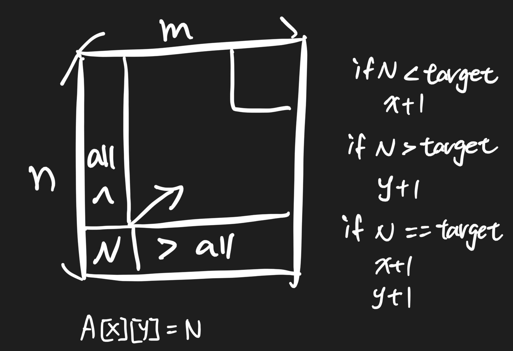

# 38. Search a 2D Matrix II \(M\)

## Problem

### Description

### Example

## Approach 

### Intuition 




### Algorithm


#### Step by Step

### Code



```python

```



```

```



### Complexity Analysis

* **Time Complexity:**
* **Space Complexity:**

