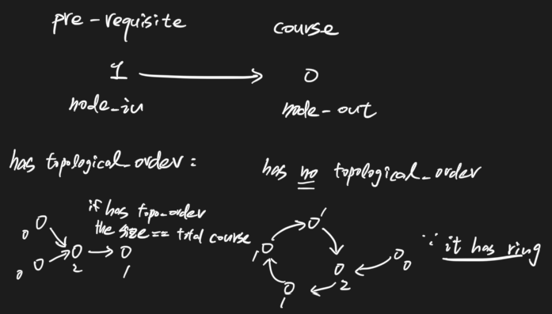
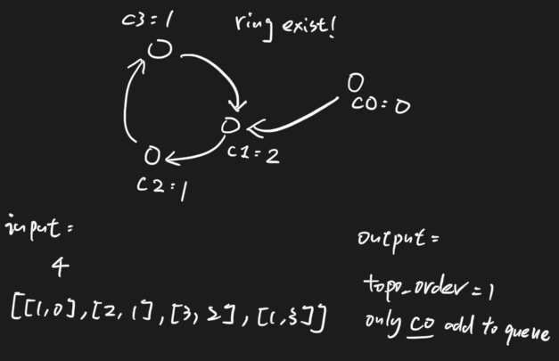

# Course Schedule II 616 \(M\)

## Problem


Asking whether has topological order or not


There are a total of n courses you have to take, labeled from `0` to `n - 1`.  
Some courses may have prerequisites, for example to take course 0 you have to first take course 1, which is expressed as a pair: `[0,1]`

Given the total number of courses and a list of prerequisite pairs, return the ordering of courses you should take to finish all courses.

There may be multiple correct orders, you just need to return one of them. If it is impossible to finish all courses, return an empty array.Example

**Example 1:**

```text
Input: n = 2, prerequisites = [[1,0]] 
Output: [0,1]
```

**Example 2:**

```text
Input: n = 4, prerequisites = [[1,0],[2,0],[3,1],[3,2]] 
Output: [0,1,2,3] or [0,2,1,3]
```

## Solution





### Code



```python
class Solution:
    """
    @param: numCourses: a total of n courses
    @param: prerequisites: a list of prerequisite pairs
    @return: the course order
    """
    def findOrder(self, numCourses, prerequisites):
        # write your code here
        # graph[i] stores the prerequisites for course ith
        graph = [[] for i in range(numCourses)]
        in_degree = [0] * numCourses

        for node_in, node_out in prerequisites:
            graph[node_out].append(node_in)
            in_degree[node_in] += 1
        
        num_choose = 0
        queue = collections.deque()
        topo_order = []

        for i in range(numCourses):
            if in_degree[i] == 0:
                queue.append(i)
        
        while queue:
            now_course = queue.popleft()
            topo_order.append(now_course)
            num_choose+=1

            for next_course in graph[now_course]:
                in_degree[next_course]-=1
                if in_degree[next_course] == 0:
                    queue.append(next_course)
        
        # if valid topo order exist, then it's length must == num of courses
        if num_choose == numCourses:
            # here would return any of the topo_order 
            return topo_order
        return []

```



```

```



### Complexity Analysis

* **Time Complexity:**
* **Space Complexity:**

