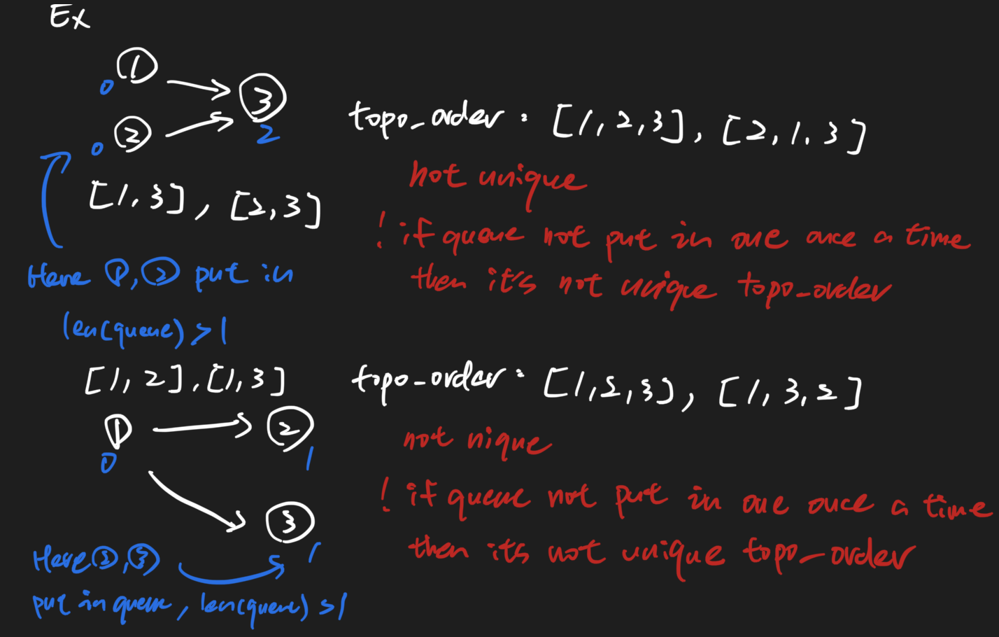

# Sequence Reconstruction 605 \(M\)

## Problem


Asking whether only one topological order


Description

Check whether the original sequence `org` can be uniquely reconstructed from the sequences in `seqs`. The org sequence is a permutation of the integers from 1 to n, with 1 \leq n \leq 10^41≤n≤10​4​​. Reconstruction means building a shortest common supersequence of the sequences in `seqs` \(i.e., a shortest sequence so that all sequences in `seqs` are subsequences of it\). Determine whether there is only one sequence that can be reconstructed from `seqs` and it is the `org` sequence.Example

Example 1:

```text
Input:org = [1,2,3], seqs = [[1,2],[1,3]]
Output: false
Explanation:
[1,2,3] is not the only one sequence that can be reconstructed, because [1,3,2] is also a valid sequence that can be reconstructed.
```

Example 2:

```text
Input: org = [1,2,3], seqs = [[1,2]]
Output: false
Explanation:
The reconstructed sequence can only be [1,2].
```

Example 3:

```text
Input: org = [1,2,3], seqs = [[1,2],[1,3],[2,3]]
Output: true
Explanation:
The sequences [1,2], [1,3], and [2,3] can uniquely reconstruct the original sequence [1,2,3].
```

Example 4:

```text
Input:org = [4,1,5,2,6,3], seqs = [[5,2,6,3],[4,1,5,2]]
Output:true
```

## Solution



### Code



```python
class Solution:
    """
    @param org: a permutation of the integers from 1 to n
    @param seqs: a list of sequences
    @return: true if it can be reconstructed only one or false
    """
    def sequenceReconstruction(self, org, seqs):
        # write your code here
        graph = self.build_graph(seqs)
        topo_order = self.topological_sort(graph)
        return topo_order == org
    
    def build_graph(self, seqs):
        # init graph
        # graph[node_i] stores all the neibors of node_i
        graph = {}
        for seq in seqs:
            for node in seq:
                # should use set(), since might repeated add same nodes
                graph[node] = set()
        for seq in seqs:
            for i in range(1, len(seq)):
                graph[seq[i - 1]].add(seq[i])
        return graph
    
    def get_indegrees(self, graph):
        indegrees = {
            node: 0
            for node in graph
        }

        for node in graph:
            for neighbor in graph[node]:
                indegrees[neighbor]+=1
        
        return indegrees
    
    def topological_sort(self, graph):
        indegrees = self.get_indegrees(graph)
        
        queue = []
        for node in graph:
            if indegrees[node] == 0:
                queue.append(node)
        
        topo_order = []
        while queue:
            # the lengh of queue can only be one, if there is only one topo order exist
            if len(queue) > 1:
                # there must exist more than one topo orders
                return None
            

            node = queue.pop()
            topo_order.append(node)
            for neighbor in graph[node]:
                indegrees[neighbor]-=1
                if indegrees[neighbor] == 0:
                    queue.append(neighbor)
        
        if len(topo_order) == len(graph):
            return topo_order

        return None            


```



```

```



### Complexity Analysis

* **Time Complexity:**
* **Space Complexity:**

