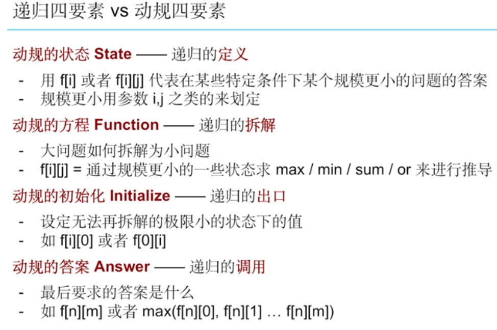
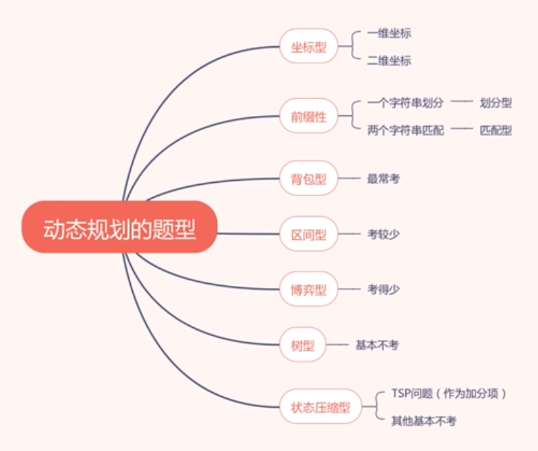

# S8. DP/Memoization

## Memoization

During DFS or Divide Conquer, use list to memorize the path have been traversed, so next time when traverse on same path no need to go through the entire path from head to end but directly takes the values from memorized array 

### Constraint

When n is large and dfs depth reach O\(n\)

For example, see XXX


1. When both time complexity and dfs depth reach O\(n\), then would stack overflow
   * Since when n reach big, at the same time dfs reach n, would overflow 
2. When time complexity is O\(n^2\) and dfs depth reach O\(n\), then would not overflow
   * Since when n reach big, at the same time dfs reach only sqrt\(n\), it's acceptable


## Dynamic Programming \(DP\) 

Big Scale problems depends on small scale problem's result

* Similar concept as recursion, divide and conquer

### Dynamic Programming vs Greedy Algorithm

* DP pursue the long term benefit and sacrifice the short term ones
* Greedy algorithm pursue the maximum benefit

### Four factors for Dynamic Programming

### Applications for Dynamic Programming

#### Applicable Scenarios

### Types of Dynamic Programming 

#### Coordination:

* 1-D: dp\[i\] represents from start - ith's optimal value/solution num/feasibility
* 2-D: dp\[i\]\[j\] represents from start - ith, jth's optimal value/solution num/feasibility
  * Problem: [Triangle](109.-triangle-m.md), [Unique Paths](114.-unique-paths-e.md)

#### Suffix:

* Partition \(劃分/接龍\):
  * 1-D: dp\[i\] represents first i characters optimal value/solution num/feasibility
  * 2-D: dp\[i\]\[j\] represents first ith charaters can partition j's parts of optimal value/solution num/feasibility
    * Problem: [word break](107.-word-break--m.md)
* Two Sequence \(匹配\): 
  * 2-D: dp\[i\]\[j\] represents string 1's first ith charaters can match string2's first j's parts of optimal value/solution num/feasibility
    * Problem: [Longest Common Subsequence](76.-longest-increasing-sequence-m.md), [Wildcard Matching](192.-wildcard-matching-h.md)

#### Interval:

* dp\[i\]\[j\] represents interval btw i/j's optimal value/solutions num/feasibility
  * Problem: [stone games](472.-stone-game-m.md), [burst balloons](168.-burst-balloons-h.md)

#### Backpack: 

* dp\[i\]\[j\] represents the optimal value/solutions num/feasibility that pick up first ith items to comprise as value j
  * Problem: backpack

**Backpack DP vs DFS**

**Time complexity:** 

* Backpack DP: O\(n \* m\)
  * n = total items, m = key value
* DFS: O\(n\*2^n\)
  * n = total items

**Which is better?**

* Ans: It depends!
* Normally DP is faster, however consider of following conditions:
  * \[1,2,4,8, 16\], m = 31, O\(n \* m\) = O\(n \* 2^n\)
  * \[1, 1000, 1000000\], m = 1001001, m &gt;&gt; 2^n, then DFS is faster 
* Concluded that if m is super large, then DFS is possibly faster
* The reason DP is normally faster:
  * \[1,2,3,4,5,5,6,7,8,9,10000\], m = 10010
  * For the first 10 elements's sum should be 10, and there are 5 combinations
  * In DP, don't care about what values inside combinations, only care about whether first n elements can constitute or not! That's the reason it's faster than DFS

