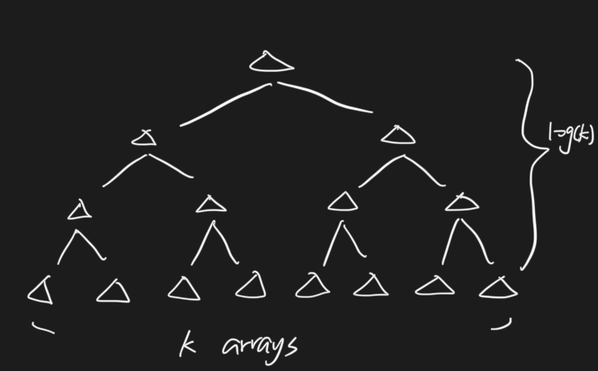

# 577. Merge K Sorted Interval Lists \(M\)

## Problem

[https://www.lintcode.com/problem/577/](https://www.lintcode.com/problem/577/)

### Description

Merge _K_ sorted interval lists into one sorted interval list. You need to merge overlapping intervals too.

### Example

**Example1**

```text
Input: [
  [(1,3),(4,7),(6,8)],
  [(1,2),(9,10)]
]
Output: [(1,3),(4,8),(9,10)]
```

**Example2**

```text
Input: [
  [(1,2),(5,6)],
  [(3,4),(7,8)]
]
Output: [(1,2),(3,4),(5,6),(7,8)]
```

## Approach - Iteratively Merge Two

### Intuition

Iteratively merge two interval lists, eventually would reach one list then return 



### Algorithm

Merge every two interval lists \(so total arrays amount would go half\), and iteratively does this to reach one final list

#### Step by Step

* While arrays amount &gt; 1:
  * Iteratively merge two sorted interval lists
    * If lists amount is odd, need to take care outside the for loop \(interval as 2\)
  * Update the original interval list
  * Eventually array would remains one
    * Return first interval list

### Code



```python
"""
Definition of Interval.
class Interval(object):
    def __init__(self, start, end):
        self.start = start
        self.end = end
"""

class Solution:
    """
    @param intervals: the given k sorted interval lists
    @return:  the new sorted interval list
    """
    def mergeKSortedIntervalLists(self, intervals):
        # write your code here
        while len(intervals) > 1:
            new_intervals, merge_interval = [], []
            for i in range(1, len(intervals), 2):
                merge_interval = self.merge_two_intervals(intervals[i - 1], intervals[i])
                new_intervals.append(merge_interval)
            if len(intervals)%2 == 1:
                new_intervals.append(intervals[len(intervals) - 1])
            intervals = new_intervals
        return intervals[0]
    
    def merge_two_intervals(self, list1, list2):
        i, j = 0, 0
        interval = []
        while i < len(list1) and j < len(list2):
            if list1[i].start < list2[j].start:
                self.push_back(interval, list1[i])
                i+=1
            else:
                self.push_back(interval, list2[j])
                j+=1
        while i < len(list1):
            self.push_back(interval, list1[i])
            i+=1
        while j < len(list2):
            self.push_back(interval, list2[j])
            j+=1
        return interval
    
    def push_back(self, intervals, interval):
        if not intervals:
            intervals.append(interval)
            return
        
        last_interval = intervals[-1]
        if last_interval.end < interval.start:
            intervals.append(interval)
            return 
        
        intervals[-1].end = max(intervals[-1].end, interval.end)
```



```

```



### Complexity Analysis

* **Time Complexity: O\(nlogk\)**
  * n as total node in lists
  * k as the amount of lists
* **Space Complexity: O\(n\)**
  * Need to create temp list to store the merge list

## Approach - Divide and Conquer Merging

### Intuition


Recursively doing split and merge \(exactly same as merge sort principle\)

### Algorithm

Split the lists from middle into halves, then recursively do this until reach every single interval list, then do the merge two by two 

#### Step by Step

* Divide and Conquer \(recursion\)
  * Split arrays into half from middle \(start, middle / middle + 1, end\)
    * Break if start &gt;= end
    * Merge two interval lists

### Code



```python
"""
Definition of Interval.
class Interval(object):
    def __init__(self, start, end):
        self.start = start
        self.end = end
"""

class Solution:
    """
    @param intervals: the given k sorted interval lists
    @return:  the new sorted interval list
    """
    def mergeKSortedIntervalLists(self, intervals):
        # write your code here
        if not intervals:
            return []
        return self.merge_helper(0, len(intervals) - 1, intervals)
    
    def merge_helper(self, start, end, intervals):
        if start >= end:
            return intervals[start]
        
        mid = (start + end)//2
        left = self.merge_helper(start, mid, intervals)
        right = self.merge_helper(mid + 1, end, intervals)
        return self.merge_two_intervals(left, right)
    
    def merge_two_intervals(self, list1, list2):
        i, j = 0, 0
        interval = []
        while i < len(list1) and j < len(list2):
            if list1[i].start < list2[j].start:
                self.push_back(interval, list1[i])
                i+=1
            else:
                self.push_back(interval, list2[j])
                j+=1
        while i < len(list1):
            self.push_back(interval, list1[i])
            i+=1
        while j < len(list2):
            self.push_back(interval, list2[j])
            j+=1
        return interval
    
    def push_back(self, intervals, interval):
        if not intervals:
            intervals.append(interval)
            return
        
        last_interval = intervals[-1]
        if last_interval.end < interval.start:
            intervals.append(interval)
            return 
        
        intervals[-1].end = max(intervals[-1].end, interval.end)
```



```

```



### Complexity Analysis

* **Time Complexity: O\(nlogk\)**
  * n as total node in lists
  * k as the amount of lists
* **Space Complexity: O\(1\)**
  * Constant space complexity

