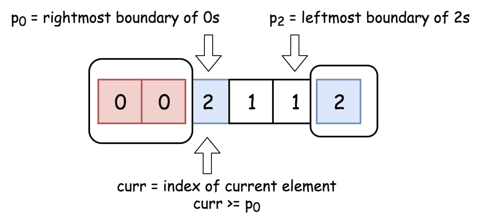

# Sort Colors 148 \(M\)

## Problem

[https://www.lintcode.com/problem/sort-colors/solution](https://www.lintcode.com/problem/sort-colors/solution)

### Description 

Given an array with _n_ objects colored _red_, _white_ or _blue_, sort them so that objects of the same color are adjacent, with the colors in the order red, white and blue.

Here, we will use the integers `0`, `1`, and `2` to represent the color red, white, and blue respectively.

### Example

**Example 1**

```text
Input : [1, 0, 1, 2]
Output : [0, 1, 1, 2]
Explanation : sort it in-place
```

## Approach: Two Pass - 1

### Intuition:

Array stores the color and its count, then traverse it to get the result

### Algorithm: 

Size-3 array stores the color and its count, then traverse it to modify the original nums array

### Algorithm: 

#### Step by step: 

* Traverse nums array to init color-count array
* Traverse color-count array to modify nums array

### Code



```python
class Solution:
    """
    @param nums: A list of integer which is 0, 1 or 2 
    @return: nothing
    """
    def sortColors(self, nums):
        if not nums:
        return 
        
        # init cnts array 
        cnts = [0 for _ in range(3)]
        for num in nums:
           cnts[num]+= 1
        
        k = 0
        # traverse cnts array and assign new value to nums 
        for i in range(len(cnts)):
            cnt = cnts[i]
            while cnt:
                nums[k] = i
                cnt-=1
                k+=1
        return nums  
```



```java
public class Solution {
    /**
     * @param nums: A list of integer which is 0, 1 or 2 
     * @return: nothing
     */
    public void sortColors(int[] nums) {
        // write your code here
        if (nums == null || nums.length == 0) {
            return;
        }
        
        int[] colorCnts = new int[3];
        for (int i = 0; i < nums.length; i++) {
            colorCnts[nums[i]]+=1;
        }
        
        int index = 0;
        for (int i = 0; i < colorCnts.length; i++) {
            int cnt = colorCnts[i];
            while(cnt > 0) {
                nums[index] = i;
                cnt--;
                index++;
            }
        }
    }
}
```



### Complexity Analysis

* **Time Complexity:** **O\(n\)**
  * Traverse array\(nums\) length
* **Space Complexity: O\(n\)**
  * Heap: O\(n\)


## Approach: Two Pass - 2

### Intuition:

Partition 2 times to make 3 elements in order 

### Algorithm: 

Partition 2 times based on 1 and 2, using two pointers: one point to smallest, and the other point to current.

#### Step by step: 

* Make the smallest pointer point to -1, and current point to 0
* if current vale &lt; partition base, then smaller pointer + 1, than swap value with current one

### Code



```python
class Solution:
    """
    @param nums: A list of integer which is 0, 1 or 2 
    @return: nothing
    """
    
    def sortColors(self, nums):
        # 3 elements require 2 partition 
        self.partition(nums, 1)
        self.partition(nums, 2)
    def partition(self, nums, k):
        last_small_pointer = -1
        for cur in range(len(nums)):
            if nums[cur] < k:
                last_small_pointer+=1
                # swap value
                nums[last_small_pointer], nums[cur] = nums[cur], nums[last_small_pointer]
```



```java
public class Solution {
    /**
     * @param nums: A list of integer which is 0, 1 or 2 
     * @return: nothing
     */
    public void sortColors(int[] nums) {
        // write your code here
        partitionArray(nums, 1);
        partitionArray(nums, 2);
    }
    
    private void partitionArray(int[] nums, int k) {
        int lastSmallPointer = -1;
        for (int i = 0; i < nums.length; i++) {
            if (nums[i] < k) {
                lastSmallPointer++;
                int tmp = nums[lastSmallPointer];
                nums[lastSmallPointer] = nums[i];
                nums[i] = tmp;
            }
        }
    }
}
```



### Complexity Analysis

* **Time Complexity:** **O\(n\)**
  * Traverse array\(nums\) length
* **Space Complexity: O\(n\)**
  * Heap: O\(n\)


## Approach: One Pass

### Intuition:

Use 2 pointers `p0/p1` at both end of array, and one point on cur. Do swap with `p0/p1` if needed



### Algorithm: 

The idea of solution is to move `curr` pointer along the array, if `nums[curr] = 0` - swap it with `nums[p0]`, if `nums[curr] = 2` - swap it with `nums[p2]`.

### Algorithm: 

#### Step by step: 

* initialize `p0/p2/cur` localtion as `0/array_length - 1/0` 
* While `curr <= p2` :
  * If `nums[curr] = 0` : swap `curr`th and `p0`th elements and move both pointers to the right.
  * If `nums[curr] = 2` : swap `curr`th and `p2`th elements. Move pointer `p2` to the left.
  * If `nums[curr] = 1` : move pointer `curr` to the right.

### Code



```python
class Solution:
    """
    @param nums: A list of integer which is 0, 1 or 2 
    @return: nothing
    """
    
    def sortColors(self, nums):
        p0, curr, p2 = 0, 0, len(nums) - 1

        while curr <= p2:
            if nums[curr] == 0:
                nums[curr], nums[p0] = nums[p0], nums[curr]
                p0+=1
                curr+=1
            elif nums[curr] == 2:
                nums[curr], nums[p2] = nums[p2], nums[curr]
                p2-=1
            else:
                curr+=1
```



### Complexity Analysis

* **Time Complexity:** **O\(n\)**
  * Traverse array\(nums\) length
* **Space Complexity: O\(1\)**
  * Constant space solution 

