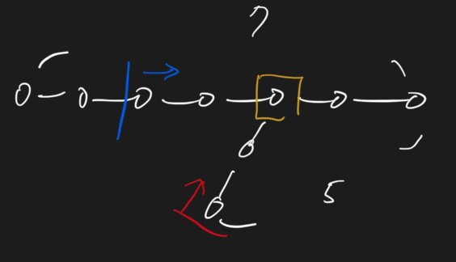

# Intersection of Two Linked Lists 380 \(M\)

## Problem

Write a program to find the node at which the intersection of two singly linked lists begins.

* If the two linked lists have no intersection at all, return `null`.
* The linked lists must retain their original structure after the function returns.
* You may assume there are no cycles anywhere in the entire linked structure.

Example

**Example 1:**

```text
Input:
	A:          a1 → a2
	                   ↘
	                     c1 → c2 → c3
	                   ↗            
	B:     b1 → b2 → b3
Output: c1
Explanation ：begin to intersect at node c1.
```

**Example 2:**

```text
Input:
Intersected at 6
1->2->3->4->5->6->7->8->9->10->11->12->13->null
6->7->8->9->10->11->12->13->null
Output: Intersected at 6
Explanation：begin to intersect at node 6.
```

Challenge

Your code should preferably run in O\(_n_\) time and use only O\(_1_\) memory.

## Approach



### Code



```python
"""
Definition of ListNode
class ListNode(object):
    def __init__(self, val, next=None):
        self.val = val
        self.next = next
"""

class Solution:
    """
    @param headA: the first list
    @param headB: the second list
    @return: a ListNode
    """
    def getIntersectionNode(self, headA, headB):
        lenA, lenB = 0, 0
        node1, node2 = headA, headB
        while node1 is not None:
            lenA += 1
            node1 = node1.next
        while node2 is not None:
            lenB += 1
            node2 = node2.next
        
        node1, node2 = headA, headB
        while lenA > lenB:
            node1 = node1.next
            lenA -= 1
        while lenB > lenA:
            node2 = node2.next
            lenB -=1
        while node1 is not node2:
            node1 = node1.next
            node2 = node2.next
        return node1
```



```

```



### Complexity Analysis

* **Time Complexity: O\(m + n\)**
  * m: len\(list1\)
  * n: len\(list2\)
* **Space Complexity: O\(1\)**

