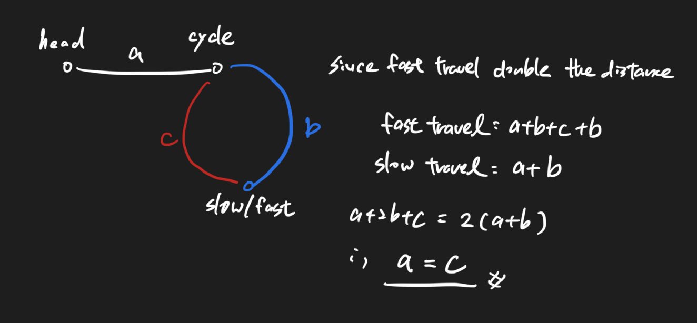

# Linked List Cycle II 103 \(H\)

## Problem

Given a linked list, return the node where the cycle begins.

If there is no cycle, return `null`.Example

Example 1:

```text
Input：null, no cycle
Output：no cycle
Explanation：
List is null, so no cycle.
```

Example 2:

```text
Input：-21->10->4->5, tail connects to node index 1
Output：10
Explanation：
The last node 5 points to the node whose index is 1, which is 10, so the entrance of the ring is 10
```

Challenge

Can you solve it without using extra space?

## Solution - Two Pointer 



### Code



```python
"""
Definition of ListNode
class ListNode(object):
    def __init__(self, val, next=None):
        self.val = val
        self.next = next
"""

class Solution:
    """
    @param head: The first node of linked list.
    @return: The node where the cycle begins. if there is no cycle, return null
    """
    def detectCycle(self, head):
        # write your code here
        slow, fast = head, head

        while fast and fast.next:
            slow = slow.next
            fast = fast.next.next

            if fast is slow:
                break
        if not fast or not fast.next:
            return None
        
        
        while head is not slow:
            head = head.next
            slow = slow.next
        
        return head
```



```

```



### Complexity Analysis

* **Time Complexity:**
* **Space Complexity:**

