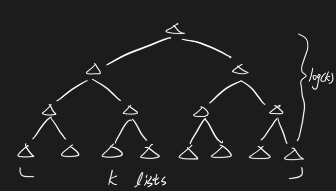
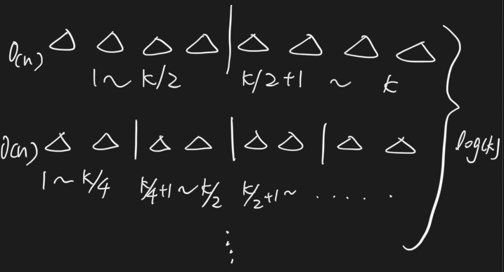

# 104. Merge K Sorted Lists \(M\)

## Problem

[https://www.lintcode.com/problem/104/](https://www.lintcode.com/problem/104/)

### Description

Merge k sorted linked lists and return it as one sorted list.

Analyze and describe its complexity.

### Example

Example 1:

```text
Input:   [2->4->null,null,-1->null]
Output:  -1->2->4->null
```

Example 2:

```text
Input: [2->6->null,5->null,7->null]
Output:  2->5->6->7->null	
```

## Approach - Iteratively Merge Two

### Intuition

Iteratively merge two list, eventually would reach one list then return 



### Algorithm

Merge every two list \(so total list mount would go half\), and iteratively does this to reach one final list

#### Step by Step

* While lists amount &gt; 1:
  * Iteratively merge two sorted list
    * If lists amount is odd, need to take care outside the for loop \(interval as 2\)
  * Update the original lists
  * Eventually lists would remains one
    * Return lists head

### Code



```python
"""
Definition of ListNode
class ListNode(object):

    def __init__(self, val, next=None):
        self.val = val
        self.next = next
"""
class Solution:
    """
    @param lists: a list of ListNode
    @return: The head of one sorted list.
    """
    def mergeKLists(self, lists):
        # write your code here
        if not list:
            return None
        
        # since eventually would be 1 list left
        while len(lists) > 1:
            new_lists, merged_list = [], ListNode(None)
            # for loop condition: start at first and 2 as interval
            for i in range(1, len(lists), 2):
                merged_list = self.merge(lists[i - 1], lists[i])
                new_lists.append(merged_list)
            if len(lists)%2 == 1:
                new_lists.append(lists[len(lists) - 1])
            lists = new_lists
        return lists[0]
    
    # merge two sorted list 
    def merge(self, n1, n2):
        dummy = ListNode(None)
        cur = dummy
        if not n1 and not n2:
            return dummy.next
        while n1 != None and n2 != None:
            if n1.val < n2.val:
                cur.next = n1
                n1 = n1.next
            else:
                cur.next = n2
                n2 = n2.next
            cur = cur.next
        if not n1:
            cur.next = n2
        if not n2:
            cur.next = n1
        return dummy.next
```



```

```



### Complexity Analysis

* **Time Complexity: O\(nlogk\)**
  * n as total node in lists
  * k as the amount of lists
* **Space Complexity: O\(n\)**
  * Need to create temp list to store the merge list


## Approach - Divide and Conquer Merging

### Intuition



Recursively doing split and merge \(exactly same as merge sort principle\)

### Algorithm

Split the lists from middle into halves, then recursively do this until reach every single list, then do the merge two by two 

#### Step by Step

* Divide and Conquer \(recursion\)
  * Split lists into half from middle \(start, middle / middle + 1, end\)
    * Break if start &gt;= end
    * Merge two lists

### Code



```python
"""
Definition of ListNode
class ListNode(object):

    def __init__(self, val, next=None):
        self.val = val
        self.next = next
"""
class Solution:
    """
    @param lists: a list of ListNode
    @return: The head of one sorted list.
    """
    def mergeKLists(self, lists):
        # write your code here
        if not list:
            return None
        
        # since eventually would be 1 list left
        return self.merge_helper(lists, 0, len(lists) - 1)
    
    def merge_helper(self, lists, start, end):
        if start >= end:
            return lists[start]
        mid = (start + end)//2
        left = self.merge_helper(lists, start, mid)
        right = self.merge_helper(lists, mid + 1, end)
        return self.merge(left, right)

    # merge two sorted list 
    def merge(self, n1, n2):
        dummy = ListNode(None)
        cur = dummy
        if not n1 and not n2:
            return dummy.next
        while n1 != None and n2 != None:
            if n1.val < n2.val:
                cur.next = n1
                n1 = n1.next
            else:
                cur.next = n2
                n2 = n2.next
            cur = cur.next
        if not n1:
            cur.next = n2
        if not n2:
            cur.next = n1
        return dummy.next
```



```

```



### Complexity Analysis

* **Time Complexity: O\(nlogk\)**
  * n as total node in lists
  * k as the amount of lists
* **Space Complexity: O\(1\)**
  * Constant space complexity

