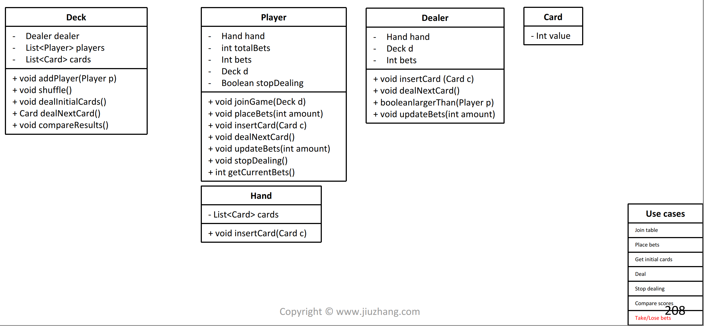

# Black Jack OO Design 714 \(M\)

## Problem

* Every player has `1000` casino token to start
* The dealer has`10000` casino token
* If the player wins，that one get double token
* If the dealer wins，deal will take the token from player
* If the points are the same, then the dealer wins
* A could be considered as `1` or `11`

Example

```text
Player(10)Player(100)Player(500)Card([1,4,2,3,1,4,2,3,9,10])InitialCards()compareResult()
```

You should return below:

```text
playerid: 1 ;Cards: 1 , 1; Current best value is: 12, current bets: 10, total bets: 990playerid: 2 ;Cards: 4 , 4; Current best value is: 8, current bets: 100, total bets: 900playerid: 3 ;Cards: 2 , 2; Current best value is: 4, current bets: 500, total bets: 500Dealer Cards: 3 , 3; Current best value is: 6, total bets: 10000playerid: 1 ;Cards: 1 , 1; Current best value is: 12, current bets: 0, total bets: 1010playerid: 2 ;Cards: 4 , 4; Current best value is: 8, current bets: 0, total bets: 1100playerid: 3 ;Cards: 2 , 2; Current best value is: 4, current bets: 0, total bets: 500Dealer Cards: 3 , 3; Current best value is: 6, total bets: 10390
```

## Clarify

* Player
  * How many players can we support in table?  \(no limit\)
  * Is there a fixed dealer or players take turns to become dealer? \(fixed dealer per table\)
* Rule
  * What if run out of cards? \(always enough\)
  * Can dealer run out of bets? \(always enough\)
* Win/Lose
* Scores
  * How many initial bets players have \(the same\)

## Solution





```python
public class BlackJack {
	private List<NormalPlayer> players;
	private Dealer dealer;

	private List<Card> cards;

	public BlackJack() {
		players = new ArrayList<>();
		dealer = new Dealer();
	}

	public void initCards(List<Card> cards) {
		this.cards = cards;
	}

	public void addPlayer(NormalPlayer p) {
		players.add(p);
	}


	public void dealInitialCards() {
		for (NormalPlayer player : players) {
			player.insertCard(dealNextCard());
		}

		dealer.insertCard(dealNextCard());

		for (NormalPlayer player : players) {
			player.insertCard(dealNextCard());
		}

		dealer.insertCard(dealNextCard());
	}

	public Card dealNextCard() {
		Card card = cards.remove(0);
		return card;
	}

	public Dealer getDealer() {
		return dealer;
	}

	public void compareResult() {
		for (NormalPlayer p : players) {
			if (dealer.largerThan(p)) {
				dealer.updateBets(p.getCurrentBets());
				p.lose();
			} else {
				dealer.updateBets(-p.getCurrentBets());
				p.win();
			}
		}
	}

	public String print() {
		String s = "";
		for (NormalPlayer player : players) {
			s += "playerid: " + (player.getId() + 1) + " ;" + player.printPlayer();
		}
		return s;
	}
}


class NormalPlayer {
	private BlackJack game;
	private int id;
	private Hand hand;
	private int totalBets;
	private int bets;
	private boolean stopDealing;

	public NormalPlayer(int id, int bets) {
		this.id = id;
		hand = new Hand();
		totalBets = 1000;
		try{
		    placeBets(bets);
		}catch(Exception e){
		    e.printStackTrace();
		}
		stopDealing = false;
	}

	public int getId() {
		return this.id;
	}

	public void insertCard(Card card) {
		hand.insertCard(card);
	}

	public int getBestValue() {
		return hand.getBestValue();
	}

	public void stopDealing() {
		stopDealing = true;
	}

	public void joinGame(BlackJack game) {
		this.game = game;
		game.addPlayer(this);
	}

	public void dealNextCard() {
		insertCard(game.dealNextCard());
	}

	public void placeBets(int amount) throws Exception {
		if (totalBets < amount) {
			throw new Exception("No enough money.");
		}
		bets = amount;
		totalBets -= bets;
	}

	public int getCurrentBets() {
		return bets;
	}

	public String printPlayer() {
		return hand.printHand() + ", current bets: " + bets + ", total bets: " + totalBets + "\n";
	}

	public void win() {
		totalBets += (bets * 2);
		bets = 0;
	}

	public void lose() {
		bets = 0;
	}
}


class Hand {
	private List<Card> cards;

	public Hand() {
		cards = new ArrayList<>();
	}

	// Get a list of possible results from hand
	private List<Integer> getPossibleValues() {
		List<Integer> results = new ArrayList<>();

		int aceCount = 0;
		int resultWithoutAce = 0;
		for (Card card : cards) {
			if (card.getValue() == 1) {
				aceCount++;
			} else if (card.getValue() == 11 || card.getValue() == 12 || card.getValue() == 13) {
				resultWithoutAce += 10;
			} else
				resultWithoutAce += card.getValue();
		}

		for (int i = 0; i <= aceCount; i++) {
			int ones = i;
			int elevens = aceCount - i;

			results.add(resultWithoutAce + ones + elevens * 11);
		}

		return results;
	}

	// -1 means went over 21, otherwise means the best value of this hand
	public int getBestValue() {
		List<Integer> results = getPossibleValues();

		int maxUnder = -1;
		for (int result : results) {
			if (result <= 21 && result > maxUnder) {
				maxUnder = result;
			}
		}
		return maxUnder;
	}

	public void insertCard(Card card) {
		cards.add(card);
	}

	public String printHand() {
		String res = "Cards: ";
		for (int i = 0; i < cards.size(); i++){
			res += (cards.get(i).getValue());
			if(i != cards.size() - 1){
				res+=" , ";
			}
			else res+=';';
		}

		res += " Current best value is: " + getBestValue();
		return res;
	}
}


class Card {
	private int value;

	public Card(int value) {
		this.value = value;
	}

	public int getValue() {
		return value;
	}
}


class Dealer {
	private BlackJack game;
	private Hand hand;
	private int bets;

	public Dealer() {
		hand = new Hand();
		bets = 10000;
	}

	public void insertCard(Card card) {
		hand.insertCard(card);
	}

	public boolean largerThan(NormalPlayer p) {
		return hand.getBestValue() >= p.getBestValue();
	}

	public void updateBets(int amount) {
		bets += amount;
	}

	public void setGame(BlackJack game) {
		this.game = game;
	}

	public void dealNextCard() {
		insertCard(game.dealNextCard());
	}

	public String printDealer() {
		return "Dealer " + hand.printHand() + ", total bets: " + bets + "\n";
	}
}
```



### Complexity Analysis

* **Time Complexity:**
* **Space Complexity:**

