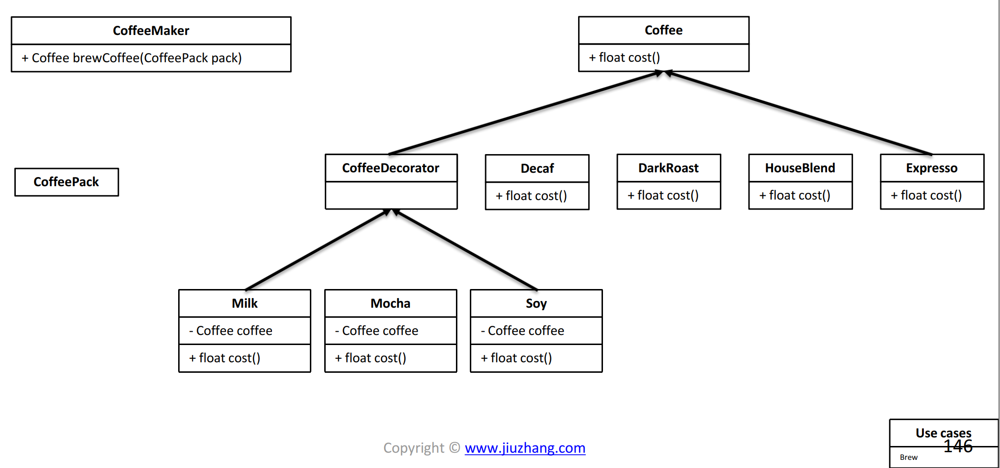
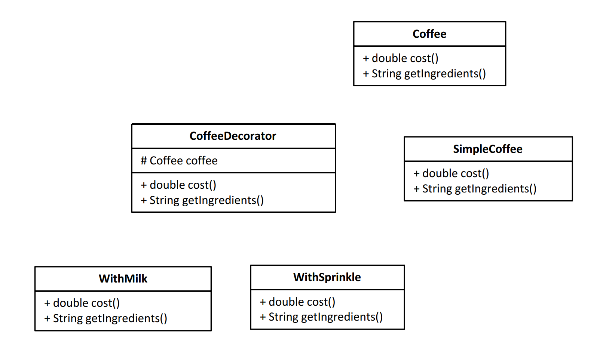

# Coffee Maker OO Design 747 \(M\)

## Problem

Can you design a coffee maker, that take a coffee pack, and can simply make a cup of coffee.

* Coffee pack contains the recipe of the coffee, like how many milk / how many sugar to be added in the coffee
* Coffee maker can make coffee based on the recipe provided by the coffee pack
* Only consider `2` type of ingredients: `sugar` and `milk`
* the cost of Plain coffee is `2`. Add one portion of milk/sugar will increase the cost by 0.5
* Consider use decorator design pattern

Example

Input:

```text
pack(2, 3)makeCoffee()
```

Output:

```text
Cost for this coffee is: 4.5Ingredients for this coffee is: Plain Coffee, Milk, Milk, Sugar, Sugar, Sugar
```

## Procedure

### Decorate Design Pattern

* Decorator pattern allows user to add new functionality to an existing object without alterning its structure. 
* This design pattern comes under structural pattern as this pattern acts as a wrapper to existing class.





## Solution 



```python

```



```java
public class CoffeeMaker {

	public Coffee makeCoffee(CoffeePack pack) {
		// write your code here

		Coffee coffee = new SimpleCoffee();

		for (int i = 0 ; i < pack.getNeededMilk(); i++) {
			coffee = new WithMilk(coffee);
		}

		for (int i = 0 ; i < pack.getNeededSugar(); i++) {
			coffee = new WithSugar(coffee);
		}

		return coffee;
	}
}

class CoffeePack {
	private int neededMilk;
	private int neededSugar;

	public CoffeePack(int neededMilk, int neededSugar) {
		this.neededMilk = neededMilk;
		this.neededSugar = neededSugar;
	}

	public int getNeededMilk() {
		return neededMilk;
	}

	public int getNeededSugar() {
		return neededSugar;
	}
}

interface Coffee {
	public double getCost();
	public String getIngredients();
}

class SimpleCoffee implements Coffee {

	@Override
	public double getCost() {
		// TODO Auto-generated method stub
		return 2;
	}

	@Override
	public String getIngredients() {
		// TODO Auto-generated method stub
		return "Plain Coffee";
	}

}

abstract class CoffeeDecorator implements Coffee {
	protected final Coffee decoratedCoffee;

	public CoffeeDecorator(Coffee coffee) {
		this.decoratedCoffee = coffee;
	}

	public double getCost() {
		return decoratedCoffee.getCost();
	}

	public String getIngredients() {
		return decoratedCoffee.getIngredients();
	}
}

class WithMilk extends CoffeeDecorator {

	public WithMilk(Coffee coffee) {
		super(coffee);
	}

	public double getCost() {
		return super.getCost() + 0.5;
	}

	public String getIngredients() {
		return super.getIngredients() + ", Milk";
	}
}

class WithSugar extends CoffeeDecorator {

	public WithSugar(Coffee coffee) {
		super(coffee);
	}

	public double getCost() {
		return super.getCost() + 0.5;
	}

	public String getIngredients() {
		return super.getIngredients() + ", Sugar";
	}
}
```



### Complexity Analysis

* **Time Complexity:**
* **Space Complexity:**

