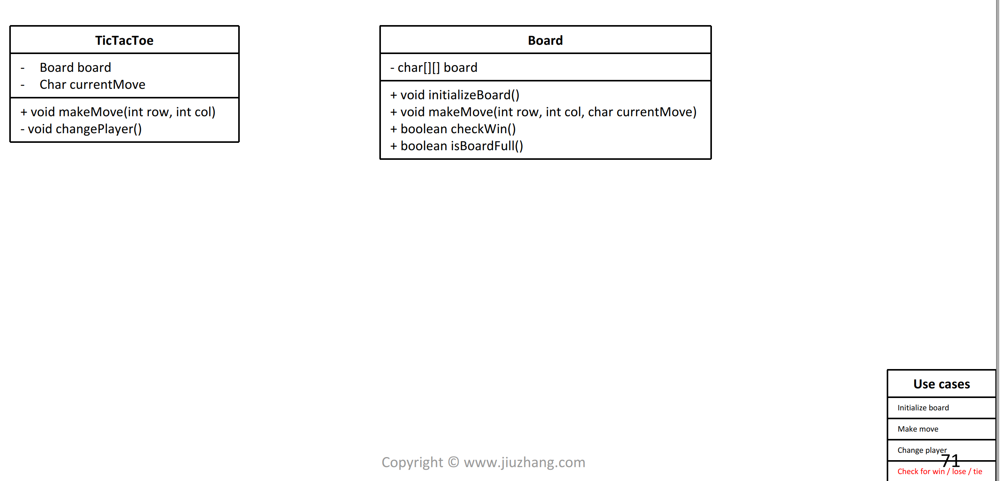

# Design Tic-Tac-Toe

## Problem

Design `Tic-Tac-Toe` game.

* board has fixed size of `3`
* `X` always take the first move
* If a place already got taken, and one player want to take that place,

an AlreadyTakenException will be thrown

* If one player wins, and somebody try to make another move, a GameEndException will be thrown.
* If all the places got taken,you should print "it's a draw"

Example

Example 1:

```text
Input:move(0, 0) // X turnmove(1, 0) // O trun move(1, 1) // X turnmove(2, 0) // O turnmove(2, 2) // X turn and winmove(0, 0)  //throw GameEndExceptionmove(0, 0) // X turnmove(0, 0) // throw AlreadyTakenExceptionmove(1, 0) // O turnmove(1, 1) // X turnmove(2, 0) // o turnmove(2, 2) // X turn and winOutput:x player wins!x player wins!
```

## Procedure



## Solution - Brute Force



```python
class TicTacToe:
    """
    @return: nothing
    """
    def __init__(self):
        self.board = [['-'] * 3 for _ in range(3)]
        self.current_player = 'x'
        self.game_end = False


    def getCurrentPlayer(self):
        # write your code
        return self.current_player
    
    def is_board_full(self):
        for i in range(3):
            for j in range(3):
                if self.board[i][j] == '-':
                    return False
        self.game_end = True
        return True
    
    def change_player(self):
        if self.current_player == 'x':
            self.current_player = 'o'
        else:
            self.current_player = 'x'
    
    def move(self, row, col):
        self.board[row][col] = self.current_player
        win = False

        # check row
        win = True
        for j in range(len(self.board)):
            if self.board[row][j] != self.current_player:
                win = False
                break
        
        if win:
            self.game_end = True
            return win
        
        # check col
        win = True
        for i in range(len(self.board)):
            if self.board[i][col] != self.current_player:
                win = False
                break
        if win:
            self.game_end = True
            return win
        
        # check back diagonal
        win = True
        for i in range(len(self.board)):
            if self.board[i][i] != self.current_player:
                win = False
                break
        
        if win:
            self.game_end = True
            return win
        
        # check forward diagonal
        win = True
        for i in range(len(self.board)):
            if self.board[i][len(self.board) - i - 1] != self.current_player:
                win = False
                break
        
        if win:
            self.game_end = True
            return win
        self.change_player()
        return win
```



```java
public class TicTacToe {
	private char[][] board;
	private char currentPlayerMark;
	private boolean gameEnd;

	public TicTacToe() {
		board = new char[3][3];
		initialize();
	}

	public char getCurrentPlayer() {
		return currentPlayerMark;
	}

	public void initialize() {
		gameEnd = false;
		currentPlayerMark = 'x';

		for (int i = 0; i < 3; i++) {
			for (int j = 0; j < 3; j++) {
				board[i][j] = '-';
			}
		}
	}

	public boolean isBoardFull() {
		for (int i = 0; i < 3; i++) {
			for (int j = 0; j < 3; j++) {
				if (board[i][j] == '-') {
					return false;
				}
			}
		}
		gameEnd = true;
		return true;
	}

	public void changePlayer() {
		if (currentPlayerMark == 'x')
			currentPlayerMark = 'o';
		else
			currentPlayerMark = 'x';
	}

	// true means this move wins the game, false means otherwise
	public boolean move(int row, int col) throws AlreadyTakenException, GameEndException {
        if (gameEnd) {
            throw new GameEndException();
        }

        if (board[row][col] != '-') {
            throw new AlreadyTakenException();
        }

        board[row][col] = currentPlayerMark;

        boolean win;

        // check row
        win = true;
        for (int j = 0; j < board.length; j++) {
            if (board[row][j] != currentPlayerMark) {
                win = false;
                break;
            }
        }

        if (win) {
            gameEnd = true;
            return win;
        }

        // check column
        win = true;
        for (int i = 0; i < board.length; i++) {
            if (board[i][col] != currentPlayerMark) {
                win = false;
                break;
            }
        }
     
        if (win) {
            gameEnd = true;
            return win;
        }

        // check back diagnal
        win = true;
        for (int i = 0; i < board.length; i++) {
            if (board[i][i] != currentPlayerMark) {
                win = false;
                break;
            }
        }
     
        if (win) {
            gameEnd = true;
            return win;
        }

        // check forward diagnal
        win = true;
        for (int i = 0; i < board.length; i++) {
            if (board[i][board.length - i - 1] != currentPlayerMark) {
                win = false;
                break;
            }
        }
     
        if (win) {
            gameEnd = true;
            return win;
        }

        changePlayer();
        return win;
    }
}


class GameEndException extends Exception{
	public GameEndException()
	{
		super("Game has been ended, cannot make any more moves");
	}
}

class AlreadyTakenException extends Exception {
	public AlreadyTakenException()
	{
		super("This place has been taken");
	}
}
```



### Complexity Analysis

* **Time Complexity:**
* **Space Complexity:**

