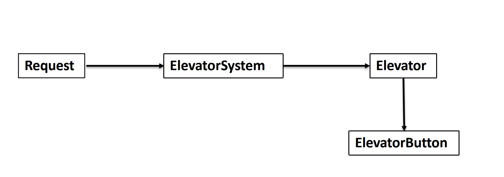
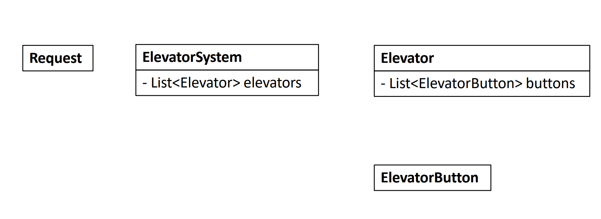

# Elevator System - OO Design

## Problem

Design a elevator system for a building

* No need to consider overweight
* The building currently has only one elevator, and this building has `n` floors
* Each elevator has three states: up, down, idle
* When the elevator moves in one direction, the reverse floor button cannot be pressed in the elevator

We have provided several implemented classes, you only need to implement some of the functions in `Elevator Class`.

We will call the elevatorStatusDescription function to test if you are in a correct state after each command.Example

**Example 1**

```text
Input:5ExternalRequest(3, "Down")ExternalRequest(1, "Up")openGate()closeGate()openGate()closeGate()Output:Currently elevator status is : DOWN.Current level is at: 1.up stop list looks like: [false, false, false, false, false].down stop list looks like:  [false, false, true, false, false].*****************************************Currently elevator status is : DOWN.Current level is at: 1.up stop list looks like: [true, false, false, false, false].down stop list looks like:  [false, false, true, false, false].*****************************************Currently elevator status is : DOWN.Current level is at: 3.up stop list looks like: [true, false, false, false, false].down stop list looks like:  [false, false, false, false, false].*****************************************Currently elevator status is : UP.Current level is at: 3.up stop list looks like: [true, false, false, false, false].down stop list looks like:  [false, false, false, false, false].*****************************************Currently elevator status is : UP.Current level is at: 1.up stop list looks like: [true, false, false, false, false].down stop list looks like:  [false, false, false, false, false].*****************************************Currently elevator status is : IDLE.Current level is at: 1.up stop list looks like: [false, false, false, false, false].down stop list looks like:  [false, false, false, false, false].*****************************************
```

**Example 2**

```text
Input:5         ExternalRequest(3, "Down")ExternalRequest(2, "Up")openGate()InternalRequest(1)closeGate()openGate()closeGate()openGate()closeGate()Output:Currently elevator status is : DOWN.Current level is at: 1.up stop list looks like: [false, false, false, false, false].down stop list looks like:  [false, false, true, false, false].*****************************************Currently elevator status is : DOWN.Current level is at: 1.up stop list looks like: [false, true, false, false, false].down stop list looks like:  [false, false, true, false, false].*****************************************Currently elevator status is : DOWN.Current level is at: 3.up stop list looks like: [false, true, false, false, false].down stop list looks like:  [false, false, false, false, false].*****************************************Currently elevator status is : DOWN.Current level is at: 3.up stop list looks like: [false, true, false, false, false].down stop list looks like:  [true, false, false, false, false].*****************************************Currently elevator status is : DOWN.Current level is at: 3.up stop list looks like: [false, true, false, false, false].down stop list looks like:  [true, false, false, false, false].*****************************************Currently elevator status is : DOWN.Current level is at: 1.up stop list looks like: [false, true, false, false, false].down stop list looks like:  [false, false, false, false, false].*****************************************Currently elevator status is : UP.Current level is at: 1.up stop list looks like: [false, true, false, false, false].down stop list looks like:  [false, false, false, false, false].*****************************************Currently elevator status is : UP.Current level is at: 2.up stop list looks like: [false, false, false, false, false].down stop list looks like:  [false, false, false, false, false].*****************************************Currently elevator status is : IDLE.Current level is at: 2.up stop list looks like: [false, false, false, false, false].down stop list looks like:  [false, false, false, false, false].*****************************************
```

## Procedure

### Clarify:

For elevator:

1. What's the weight limit of the elevator?
2. Do we need to consider overweight for elevator system?
3. Different type of elevator? 
   1. Airstairs, Goods Elevator \(for this problem, all elevators are the same\)

For building:

1. When receiving requests, how many elevators can serve? \(For this problem, all elevator can serve\)

Elevator rules:

1. Is there overweight detection? How to detect?
2. When pushing buttons, which one will operate?
3. When operating, how many buttons can react? 
4. For this problem, same direction &gt; static &gt; opposite direction

### Core Object

Object as main character, and check for the objects matching relationship with others

In URL diagram, 

* symbol `-` means private type
* symbol `*` means protected type





### Uses Cases

List the uses cases for every object, uses case only need one sentence to briefly describe

* Elevator System:
  * Handle Request \(External and Internal\)
  *  Open gate

## Solution 



```python

```



### Complexity Analysis

* **Time Complexity:**
* **Space Complexity:**

